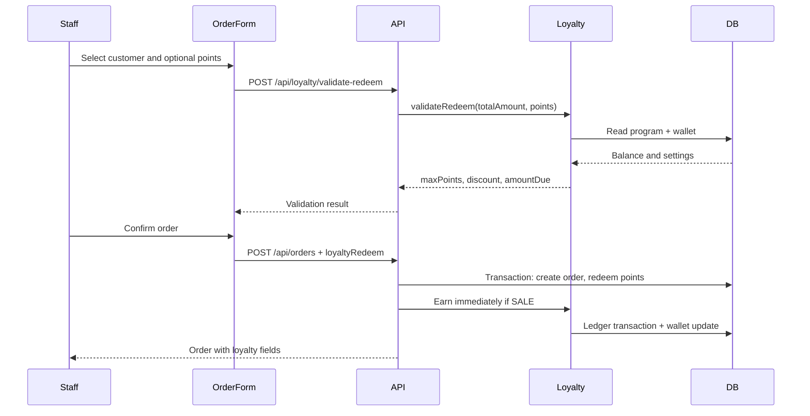

# Technical Design — Loyalty Program

**Status**: Proposed, ready for implementation after review  
**Scope**: Merchant-level loyalty points, manual staff redemption, membership tiers, and plan gating for Professional+ merchants. Promotion rules such as "order > 100 gets 10% off" remain out of scope and belong to the future Promotion module.

## 0. Key Design Decisions

| Decision | Chosen Approach | Reason |
|----------|-----------------|--------|
| Program ownership | ONE `LoyaltyProgram` per merchant | Customer and points are merchant-scoped, shared across outlets. |
| Redemption behavior | Staff opt-in only | Prevents surprise discounts and keeps Loyalty separate from Promotion auto-apply rules. |
| Order amount semantics | `Order.totalAmount` is after manual discount, before loyalty discount | Current order form already calculates `totalAmount = subtotal - discountAmount`; loyalty must not subtract manual discount twice. |
| Amount customer pays | `amountDue = max(0, order.totalAmount - loyaltyDiscount)` | Keeps existing `totalAmount` behavior stable while making loyalty discount explicit. |
| Tier benefit in v1 | Earn multiplier only; `benefits` is display-only | Percentage/threshold discounts belong to Promotion, not Loyalty. |
| Tier policy in v1 | `tierPeriod = lifetime`, `tierDowngrade = never` by default | Matches the lowest-risk MVP; fields exist so future policies can be enabled without migration churn. |
| Earn timing | SALE earns on create; RENT earns on RETURNED using final order amount | RENT totals can change due to late/damage fees. |
| Expiry | Supported by schema via point lots; daily worker can process expiry | Required for per-transaction expiry and yearly reset without corrupting ledger history. |



## 1. Database Schema (Prisma)

### 1.1 New Models

```prisma
/// Loyalty program configuration — ONE per merchant
model LoyaltyProgram {
  id                Int       @id @default(autoincrement())
  merchantId        Int       @unique
  name              String    @default("Chương trình khách hàng thân thiết")
  isActive          Boolean   @default(true)

  // Earn - RENT
  rentEarnEnabled   Boolean   @default(true)
  rentEarnRate      Int       @default(1)
  rentEarnPerAmount Float     @default(10000)

  // Earn - SALE
  saleEarnEnabled   Boolean   @default(true)
  saleEarnRate      Int       @default(1)
  saleEarnPerAmount Float     @default(10000)

  // Redeem
  pointValue        Float     @default(1000)
  minRedeemPoints   Int       @default(10)
  maxRedeemPercent  Float     @default(50)
  redeemOnRent      Boolean   @default(true)
  redeemOnSale      Boolean   @default(true)

  // Tier config
  tierMetric        String    @default("total_spend") // total_spend | total_orders
  tierPeriod        String    @default("lifetime")    // lifetime | yearly (v1 uses lifetime)
  tierDowngrade     String    @default("never")       // never | immediate | grace_30d (v1 uses never)

  // Expiry config
  pointsExpiryMode  String    @default("never")       // never | per_transaction | yearly_reset
  pointsExpiryDays  Int?
  yearlyResetMonth  Int?
  yearlyResetDay    Int?

  createdAt         DateTime  @default(now())
  updatedAt         DateTime  @updatedAt

  merchant          Merchant  @relation(fields: [merchantId], references: [id], onDelete: Cascade)
  tiers             LoyaltyTier[]
}
```


```prisma
/// Membership tier definition — merchant defines N tiers
model LoyaltyTier {
  id            Int       @id @default(autoincrement())
  programId     Int
  name          String    // "Thành viên", "Bạc", "Vàng", "Kim Cương"
  threshold     Float     @default(0) // Min metric value to qualify
  multiplier    Float     @default(1.0) // Earn multiplier (1.0 = no bonus)
  benefits      String    @default("[]") // JSON display-only text
  color         String?   // Hex color for badge
  icon          String?   // Icon name or URL
  sortOrder     Int       @default(0)

  createdAt     DateTime  @default(now())
  updatedAt     DateTime  @updatedAt

  program       LoyaltyProgram @relation(fields: [programId], references: [id], onDelete: Cascade)
  customers     CustomerLoyalty[]

  @@index([programId, threshold])
  @@index([programId, sortOrder])
}
```


```prisma
/// Customer loyalty balance — ONE per customer per merchant
model CustomerLoyalty {
  id              Int       @id @default(autoincrement())
  customerId      Int
  merchantId      Int
  points          Int       @default(0)     // Current balance (can be negative)
  totalEarned     Int       @default(0)     // Lifetime earned
  totalRedeemed   Int       @default(0)     // Lifetime redeemed
  totalSpent      Float     @default(0)     // Sum of order.totalAmount when points are earned
  totalOrders     Int       @default(0)     // Count of completed orders
  currentTierId   Int?

  createdAt       DateTime  @default(now())
  updatedAt       DateTime  @updatedAt

  customer        Customer  @relation(fields: [customerId], references: [id], onDelete: Cascade)
  merchant        Merchant  @relation(fields: [merchantId], references: [id], onDelete: Cascade)
  currentTier     LoyaltyTier? @relation(fields: [currentTierId], references: [id], onDelete: SetNull)
  pointLots       LoyaltyPointLot[]

  @@unique([customerId, merchantId])
  @@index([merchantId, points])
  @@index([merchantId, totalSpent])
  @@index([merchantId, currentTierId])
}
```


```prisma
/// Immutable ledger of all point transactions
model LoyaltyTransaction {
  id              Int       @id @default(autoincrement())
  customerId      Int
  merchantId      Int
  outletId        Int?      // Trace: which outlet this happened at; null for merchant-level manual adjust
  orderId         Int?      // Link to order (null for manual adjust)
  type            String    // earn | redeem | adjust | refund | expire | tier_upgrade
  points          Int       // Signed: +earn, -redeem, +/-adjust, +refund
  balanceAfter    Int       // Customer balance after this transaction
  description     String?   // Human-readable description
  metadata        String?   // JSON: {ruleId, multiplier, fromTier, toTier, reason}
  createdAt       DateTime  @default(now())
  createdById     Int?      // Staff who performed action (null for system)

  customer        Customer  @relation(fields: [customerId], references: [id], onDelete: Cascade)
  merchant        Merchant  @relation(fields: [merchantId], references: [id], onDelete: Cascade)
  order           Order?    @relation(fields: [orderId], references: [id], onDelete: SetNull)
  pointLots       LoyaltyPointLot[]

  @@index([customerId, merchantId, createdAt])
  @@index([orderId, type])
  @@index([merchantId, type, createdAt])
  @@index([outletId, createdAt])
}
```

```prisma
/// Point lots let per-transaction expiry and FIFO redemption work without mutating earn ledger rows.
model LoyaltyPointLot {
  id                Int       @id @default(autoincrement())
  customerLoyaltyId Int
  earnTransactionId Int
  pointsEarned      Int
  remainingPoints   Int
  expiresAt         DateTime?
  createdAt         DateTime  @default(now())
  updatedAt         DateTime  @updatedAt

  customerLoyalty   CustomerLoyalty     @relation(fields: [customerLoyaltyId], references: [id], onDelete: Cascade)
  earnTransaction   LoyaltyTransaction  @relation(fields: [earnTransactionId], references: [id], onDelete: Cascade)

  @@index([customerLoyaltyId, expiresAt])
  @@index([earnTransactionId])
  @@index([expiresAt, remainingPoints])
}
```


### 1.2 Modified Models

```prisma
/// Order — add loyalty fields
model Order {
  // ... existing fields ...

  // NEW loyalty fields
  loyaltyPointsRedeemed  Int       @default(0)  // Points used for discount
  loyaltyDiscount        Float     @default(0)  // Monetary discount (points × pointValue)
  loyaltyPointsEarned    Int       @default(0)  // Points earned from this order
  loyaltyTransactions    LoyaltyTransaction[]
}
```

```prisma
/// Merchant — add relation
model Merchant {
  // ... existing fields ...
  loyaltyProgram   LoyaltyProgram?
  customerLoyalty  CustomerLoyalty[]
}

/// Customer — add relation
model Customer {
  // ... existing fields ...
  loyaltyRecords   CustomerLoyalty[]
  loyaltyTransactions LoyaltyTransaction[]
}
```

### 1.3 Indexes Summary

| Model | Index | Purpose |
|-------|-------|---------|
| LoyaltyProgram | `@@unique([merchantId])` | One program per merchant |
| LoyaltyTier | `(programId, threshold)` | Fast tier lookup by threshold |
| CustomerLoyalty | `@@unique([customerId, merchantId])` | One record per customer per merchant |
| CustomerLoyalty | `(merchantId, points)` | List customers by points |
| CustomerLoyalty | `(merchantId, totalSpent)` | Tier evaluation queries |
| LoyaltyTransaction | `(customerId, merchantId, createdAt)` | Customer history |
| LoyaltyTransaction | `(orderId, type)` | Duplicate earn prevention |
| LoyaltyTransaction | `(merchantId, type, createdAt)` | Analytics/reporting |
| LoyaltyPointLot | `(customerLoyaltyId, expiresAt)` | FIFO redemption and expiry |
| LoyaltyPointLot | `(expiresAt, remainingPoints)` | Daily expiry worker |


---

## 2. API Design

All API routes must use the repository standard pattern:

- `withAuthRoles` / permission checks from `@rentalshop/auth`
- `ResponseBuilder` and `handleApiError` from `@rentalshop/utils`
- Backend-only merchant/outlet scoping from the authenticated user context
- Plan feature gate before reading or mutating loyalty data

### 2.1 Program Configuration

#### GET /api/loyalty/program

```
Response 200:
{
  "success": true,
  "data": {
    "id": 1,
    "merchantId": 5,
    "name": "Chương trình khách hàng thân thiết",
    "isActive": true,
    "rentEarnEnabled": true,
    "rentEarnRate": 1,
    "rentEarnPerAmount": 10000,
    "saleEarnEnabled": true,
    "saleEarnRate": 1,
    "saleEarnPerAmount": 20000,
    "pointValue": 1000,
    "minRedeemPoints": 10,
    "maxRedeemPercent": 50,
    "redeemOnRent": true,
    "redeemOnSale": true,
    "tierMetric": "total_spend",
    "tierPeriod": "lifetime",
    "tierDowngrade": "never",
    "pointsExpiryMode": "never",
    "pointsExpiryDays": null,
    "yearlyResetMonth": null,
    "yearlyResetDay": null
  }
}

Response 200 (not set up):
{ "success": true, "data": null }
```

Permission: `loyalty.view`


#### PUT /api/loyalty/program

```
Request Body:
{
  "name": "Chương trình khách hàng thân thiết",
  "isActive": true,
  "rentEarnEnabled": true,
  "rentEarnRate": 1,
  "rentEarnPerAmount": 10000,
  "saleEarnEnabled": true,
  "saleEarnRate": 1,
  "saleEarnPerAmount": 20000,
  "pointValue": 1000,
  "minRedeemPoints": 10,
  "maxRedeemPercent": 50,
  "redeemOnRent": true,
  "redeemOnSale": true,
  "tierMetric": "total_spend",
  "tierPeriod": "lifetime",
  "tierDowngrade": "never",
  "pointsExpiryMode": "never",
  "pointsExpiryDays": null,
  "yearlyResetMonth": null,
  "yearlyResetDay": null
}

Response 200:
{ "success": true, "data": { ...program }, "code": "PROGRAM_UPDATED" }

Validation:
- earnRate > 0
- earnPerAmount > 0
- pointValue > 0
- maxRedeemPercent: 1-100
- minRedeemPoints >= 1
- tierMetric: total_spend | total_orders
- tierPeriod: lifetime | yearly (v1 behavior: lifetime only)
- tierDowngrade: never | immediate | grace_30d (v1 behavior: never only)
- pointsExpiryMode: never | per_transaction | yearly_reset
- if pointsExpiryMode = per_transaction, pointsExpiryDays > 0
- if pointsExpiryMode = yearly_reset, yearlyResetMonth is 1-12 and yearlyResetDay is 1-28
```

Permission: `loyalty.manage`
Behavior: Upsert (create if not exists, update if exists). On first create, the service also creates a default tier with `threshold = 0`, `multiplier = 1.0`, and `sortOrder = 0`.


### 2.2 Tier Management

#### GET /api/loyalty/tiers

```
Response 200:
{
  "success": true,
  "data": [
    { "id": 1, "name": "Thành viên", "threshold": 0, "multiplier": 1.0, "color": "#888", "icon": null, "sortOrder": 0 },
    { "id": 2, "name": "Bạc", "threshold": 500000, "multiplier": 1.2, "color": "#C0C0C0", "icon": "star", "sortOrder": 1 },
    { "id": 3, "name": "Vàng", "threshold": 2000000, "multiplier": 1.5, "color": "#FFD700", "icon": "crown", "sortOrder": 2 }
  ]
}
```

Permission: `loyalty.view`

#### POST /api/loyalty/tiers

```
Request Body:
{ "name": "Kim Cương", "threshold": 10000000, "multiplier": 2.0, "color": "#B9F2FF", "icon": "diamond", "benefits": "[\"VIP support\"]" }

Validation:
- name: required, non-empty
- threshold: >= 0
- multiplier: >= 1.0
- Must have at least 1 tier with threshold=0 in the program
```

Permission: `loyalty.manage`

#### PUT /api/loyalty/tiers/[id]

```
Request Body: (partial update)
{ "name": "Bạc Plus", "threshold": 600000, "multiplier": 1.3 }
```

Permission: `loyalty.manage`

#### DELETE /api/loyalty/tiers/[id]

```
Behavior:
- Cannot delete if it's the last tier
- Customers at this tier → move to nearest lower tier
- Returns count of affected customers in response

Response 200:
{ "success": true, "data": { "deletedTierId": 3, "customersReassigned": 12, "newTierId": 2 } }
```

Permission: `loyalty.manage`


### 2.3 Customer Loyalty

#### GET /api/loyalty/customers/[id]/summary

```
Response 200:
{
  "success": true,
  "data": {
    "customerId": 42,
    "points": 150,
    "totalEarned": 500,
    "totalRedeemed": 350,
    "totalSpent": 3500000,
    "totalOrders": 12,
    "tier": {
      "id": 2,
      "name": "Bạc",
      "color": "#C0C0C0",
      "icon": "star",
      "multiplier": 1.2
    },
    "nextTier": {
      "name": "Vàng",
      "threshold": 2000000,
      "remaining": 500000  // How much more to spend
    },
    "canRedeem": true,
    "maxRedeemPoints": 150
  }
}

Response 200 (no loyalty record yet):
{
  "success": true,
  "data": {
    "customerId": 42,
    "points": 0,
    "totalEarned": 0,
    "totalRedeemed": 0,
    "totalSpent": 0,
    "totalOrders": 0,
    "tier": { "id": 1, "name": "Thành viên", "color": "#888", ... },
    "nextTier": { "name": "Bạc", "threshold": 500000, "remaining": 500000 },
    "canRedeem": false,
    "maxRedeemPoints": 0
  }
}
```

Permission: `loyalty.view`
Behavior: Auto-creates CustomerLoyalty record if not exists (lazy initialization)


#### GET /api/loyalty/customers/[id]/transactions

```
Query params: ?page=1&limit=20&type=earn|redeem|adjust|refund

Response 200:
{
  "success": true,
  "data": {
    "transactions": [
      {
        "id": 101,
        "type": "earn",
        "points": 52,
        "balanceAfter": 202,
        "description": "Tích điểm từ đơn #456789",
        "orderId": 123,
        "outletId": 1,
        "outletName": "Chi nhánh Q1",
        "createdAt": "2026-07-10T10:30:00Z"
      },
      {
        "id": 100,
        "type": "redeem",
        "points": -50,
        "balanceAfter": 150,
        "description": "Đổi điểm cho đơn #456780",
        "orderId": 120,
        "outletId": 2,
        "outletName": "Chi nhánh Q7",
        "createdAt": "2026-07-08T14:00:00Z"
      }
    ],
    "total": 45,
    "page": 1,
    "limit": 20
  }
}
```

Permission: `loyalty.view`


### 2.4 Redeem Validation

#### POST /api/loyalty/validate-redeem

```
Request Body:
{
  "customerId": 42,
  "points": 100,
  "orderTotalAmount": 450000,
  "orderType": "RENT"
}

Response 200 (valid):
{
  "success": true,
  "data": {
    "valid": true,
    "requestedPoints": 100,
    "discount": 100000,
    "maxPoints": 200,
    "maxDiscount": 200000,
    "amountDue": 350000,
    "currentBalance": 200,
    "balanceAfterRedeem": 100
  }
}

Response 200 (invalid):
{
  "success": true,
  "data": {
    "valid": false,
    "reason": "INSUFFICIENT_POINTS",
    "currentBalance": 50,
    "requestedPoints": 100
  }
}

Possible reasons:
- INSUFFICIENT_POINTS
- BELOW_MINIMUM (< minRedeemPoints)
- EXCEEDS_MAX_PERCENT
- EXCEEDS_REMAINING_AMOUNT
- REDEEM_DISABLED_FOR_ORDER_TYPE
- PROGRAM_INACTIVE
- NO_LOYALTY_RECORD
```

Permission: `orders.create`

#### POST /api/loyalty/calculate-earn

```
Request Body:
{
  "customerId": 42,
  "orderType": "SALE",
  "orderTotalAmount": 450000,
  "loyaltyDiscount": 100000
}

Response 200:
{
  "success": true,
  "data": {
    "estimatedPoints": 35,
    "eligibleAmount": 350000,
    "tier": { "id": 2, "name": "Bạc", "multiplier": 1.2 },
    "isEstimate": true
  }
}
```

Permission: `orders.view`
Behavior: Returns an estimate only. For RENT orders, final earn is recalculated when the order becomes `RETURNED` using the latest final order amount.


### 2.5 Manual Adjustment

#### POST /api/loyalty/adjust

```
Request Body:
{
  "customerId": 42,
  "points": 50,       // Positive = add, negative = deduct
  "reason": "Bù điểm do lỗi hệ thống"
}

Response 200:
{
  "success": true,
  "data": {
    "transaction": { "id": 105, "type": "adjust", "points": 50, "balanceAfter": 252 },
    "newBalance": 252
  }
}
```

Permission: `loyalty.adjust` (MERCHANT only)


### 2.6 Order Integration (existing endpoints, extended)

#### POST /api/orders — Extended with loyalty

```
Request Body (additions):
{
  // ...existing order fields...
  "loyaltyRedeem": {     // Optional, staff opts in
    "points": 100
  }
}

Response (additions in order object):
{
  "loyaltyPointsRedeemed": 100,
  "loyaltyDiscount": 100000,
  "amountDue": 350000,
  "loyaltyPointsEarned": 35   // For SALE (immediate). null for RENT
}
```

#### PUT /api/orders/[id] — Status change triggers earn

When `status` changes to `RETURNED`:
- Server reloads the latest order and auto-calculates earn using final `totalAmount`, including late/damage fee changes already reflected in the order
- Sets `loyaltyPointsEarned` on order
- Creates earn transaction
- Checks tier upgrade

When loyalty redemption changes during order edit:
- If redeemed points increase, validate and deduct only the additional points
- If redeemed points decrease, refund the difference
- If redemption is removed, refund all redeemed points and set `loyaltyPointsRedeemed = 0`, `loyaltyDiscount = 0`
- Recalculate `amountDue = max(0, totalAmount - loyaltyDiscount)`

---

## 3. Core Business Logic

### 3.1 Earn Engine (pseudo-code)

```typescript
// packages/loyalty/src/earn.ts

interface EarnInput {
  order: Order;             // With orderItems
  program: LoyaltyProgram;
  customerLoyalty: CustomerLoyalty;
  currentTier: LoyaltyTier;
}

function calculateEarn(input: EarnInput): number {
  const { order, program, customerLoyalty, currentTier } = input;

  // 1. Determine config by order type
  const config = order.orderType === 'RENT'
    ? { enabled: program.rentEarnEnabled, rate: program.rentEarnRate, perAmount: program.rentEarnPerAmount }
    : { enabled: program.saleEarnEnabled, rate: program.saleEarnRate, perAmount: program.saleEarnPerAmount };

  if (!config.enabled) return 0;

  // 2. Calculate eligible amount
  // Existing Order.totalAmount is already subtotal after manual discount.
  // Do NOT subtract order.discountAmount again, or points will be under-awarded.
  const loyaltyDiscount = order.loyaltyDiscount || 0;
  const eligibleAmount = Math.max(0, order.totalAmount - loyaltyDiscount);

  if (eligibleAmount <= 0) return 0;

  // 3. Calculate base points
  const basePoints = Math.floor(eligibleAmount / config.perAmount) * config.rate;

  // 4. Apply tier multiplier
  const earnedPoints = Math.floor(basePoints * currentTier.multiplier);

  return earnedPoints;
}
```


### 3.2 Redeem Engine (pseudo-code)

```typescript
// packages/loyalty/src/redeem.ts

interface RedeemInput {
  customerId: number;
  merchantId: number;
  points: number;          // Requested points to redeem
  orderTotalAmount: number; // Existing Order.totalAmount = subtotal - manual discount
  orderType: 'RENT' | 'SALE';
}

interface RedeemResult {
  valid: boolean;
  reason?: string;
  discount?: number;
  amountDue?: number;
  maxPoints?: number;
}

function validateRedeem(input: RedeemInput, program: LoyaltyProgram, loyalty: CustomerLoyalty): RedeemResult {
  // 1. Program active?
  if (!program.isActive) return { valid: false, reason: 'PROGRAM_INACTIVE' };

  // 2. Redeem allowed for order type?
  if (input.orderType === 'RENT' && !program.redeemOnRent) return { valid: false, reason: 'REDEEM_DISABLED_FOR_ORDER_TYPE' };
  if (input.orderType === 'SALE' && !program.redeemOnSale) return { valid: false, reason: 'REDEEM_DISABLED_FOR_ORDER_TYPE' };

  // 3. Sufficient balance?
  if (loyalty.points < input.points) return { valid: false, reason: 'INSUFFICIENT_POINTS' };

  // 4. Minimum met?
  if (input.points < program.minRedeemPoints) return { valid: false, reason: 'BELOW_MINIMUM' };

  // 5. Max percent cap
  const maxByPercent = Math.floor(input.orderTotalAmount * program.maxRedeemPercent / 100 / program.pointValue);
  if (input.points > maxByPercent) return { valid: false, reason: 'EXCEEDS_MAX_PERCENT' };

  // 6. Cannot exceed remaining amount
  const maxByRemaining = Math.floor(input.orderTotalAmount / program.pointValue);
  if (input.points > maxByRemaining) return { valid: false, reason: 'EXCEEDS_REMAINING_AMOUNT' };

  const discount = input.points * program.pointValue;
  const amountDue = Math.max(0, input.orderTotalAmount - discount);
  const maxPoints = Math.min(loyalty.points, maxByPercent, maxByRemaining);

  return { valid: true, discount, amountDue, maxPoints };
}
```

`orderTotalAmount` intentionally uses the existing order model's meaning: item subtotal after manual discount. Do not subtract `discountAmount` again in loyalty logic.


### 3.3 Tier Evaluation (pseudo-code)

```typescript
// packages/loyalty/src/tier.ts

async function evaluateTierUpgrade(
  customerLoyalty: CustomerLoyalty,
  program: LoyaltyProgram,
  tiers: LoyaltyTier[]
): Promise<LoyaltyTier | null> {
  // 1. Determine metric value
  const metricValue = program.tierMetric === 'total_spend'
    ? customerLoyalty.totalSpent
    : customerLoyalty.totalOrders;

  // 2. Sort tiers by threshold DESC (highest first)
  const sortedTiers = tiers.sort((a, b) => b.threshold - a.threshold);

  // 3. Find highest qualifying tier
  const qualifyingTier = sortedTiers.find(t => metricValue >= t.threshold);
  if (!qualifyingTier) return null;

  // 4. Check if upgrade (never downgrade in v1)
  if (!customerLoyalty.currentTierId) return qualifyingTier;
  
  const currentTier = tiers.find(t => t.id === customerLoyalty.currentTierId);
  if (!currentTier) return qualifyingTier;

  // Only upgrade, never downgrade
  if (qualifyingTier.threshold > currentTier.threshold) {
    return qualifyingTier; // Upgrade!
  }

  return null; // No change
}
```


### 3.4 Order Creation with Loyalty (transaction flow)

```typescript
// In POST /api/orders handler — after order is created

async function handleLoyaltyOnOrderCreate(order, loyaltyRedeem, user, outlet) {
  if (!order.customerId) return; // No customer = no loyalty

  const program = await getLoyaltyProgram(outlet.merchantId);
  if (!program || !program.isActive) return;

  const merchantId = outlet.merchantId;

  await prisma.$transaction(async (tx) => {
    // 1. REDEEM (if requested)
    if (loyaltyRedeem?.points > 0) {
      const loyalty = await tx.customerLoyalty.findUnique({
        where: { customerId_merchantId: { customerId: order.customerId, merchantId } }
      });

      // Validate (race-safe: check inside transaction)
      if (!loyalty || loyalty.points < loyaltyRedeem.points) {
        throw new Error('INSUFFICIENT_POINTS');
      }

      const discount = loyaltyRedeem.points * program.pointValue;
      const amountDue = Math.max(0, order.totalAmount - discount);

      // Deduct points with a conditional update to prevent concurrent double-spend.
      const updatedCount = await tx.customerLoyalty.updateMany({
        where: { id: loyalty.id, points: { gte: loyaltyRedeem.points } },
        data: { points: { decrement: loyaltyRedeem.points }, totalRedeemed: { increment: loyaltyRedeem.points } }
      });
      if (updatedCount.count !== 1) throw new Error('INSUFFICIENT_POINTS');

      const updated = await tx.customerLoyalty.findUniqueOrThrow({ where: { id: loyalty.id } });

      if (program.pointsExpiryMode === 'per_transaction') {
        // Consume point lots FIFO by earliest expiresAt.
        await consumePointLotsFIFO(tx, loyalty.id, loyaltyRedeem.points);
      }

      // Create redeem transaction
      await tx.loyaltyTransaction.create({
        data: {
          customerId: order.customerId,
          merchantId,
          outletId: order.outletId,
          orderId: order.id,
          type: 'redeem',
          points: -loyaltyRedeem.points,
          balanceAfter: updated.points,
          description: `Đổi điểm cho đơn #${order.orderNumber}`,
          createdById: user.id
        }
      });

      // Update order
      await tx.order.update({
        where: { id: order.id },
        data: {
          loyaltyPointsRedeemed: loyaltyRedeem.points,
          loyaltyDiscount: discount,
          // amountDue is derived for responses and payment calculation; existing schema may not store it.
          // Do not overwrite totalAmount because totalAmount remains after manual discount, before loyalty.
        }
      });
    }

    // 2. EARN (for SALE orders only — RENT earns on return)
    if (order.orderType === 'SALE') {
      // Reload so calculateEarn sees loyaltyDiscount set above.
      const orderForEarn = await tx.order.findUniqueOrThrow({ where: { id: order.id } });
      await processEarn(tx, orderForEarn, program, merchantId, user);
    }
  });
}
```


### 3.5 Earn Processing (shared by SALE create & RENT return)

```typescript
async function processEarn(tx, order, program, merchantId, user) {
  // Prevent duplicate
  const existing = await tx.loyaltyTransaction.findFirst({
    where: { orderId: order.id, type: 'earn' }
  });
  if (existing) return; // Already earned

  // Get or create customer loyalty
  let loyalty = await tx.customerLoyalty.upsert({
    where: { customerId_merchantId: { customerId: order.customerId, merchantId } },
    create: { customerId: order.customerId, merchantId, points: 0, currentTierId: getDefaultTierId(program) },
    update: {}
  });

  // Get current tier
  const currentTier = loyalty.currentTierId
    ? await tx.loyaltyTier.findUnique({ where: { id: loyalty.currentTierId } })
    : await getDefaultTier(tx, program.id);

  // Calculate earn. For RENT, caller must pass the latest order after RETURNED updates
  // so lateFee/damageFee reflected in order.totalAmount are included.
  const earnedPoints = calculateEarn({ order, program, customerLoyalty: loyalty, currentTier });
  if (earnedPoints <= 0) return;

  // Update balance + metrics
  const earnedMetricAmount = order.totalAmount; // After manual discount, before loyalty discount
  const updated = await tx.customerLoyalty.update({
    where: { id: loyalty.id },
    data: {
      points: { increment: earnedPoints },
      totalEarned: { increment: earnedPoints },
      totalSpent: { increment: earnedMetricAmount },
      totalOrders: { increment: 1 }
    }
  });

  // Create earn transaction
  const earnTransaction = await tx.loyaltyTransaction.create({
    data: {
      customerId: order.customerId,
      merchantId,
      outletId: order.outletId,
      orderId: order.id,
      type: 'earn',
      points: earnedPoints,
      balanceAfter: updated.points,
      description: `Tích điểm từ đơn #${order.orderNumber}`,
      metadata: JSON.stringify({ multiplier: currentTier.multiplier, tierName: currentTier.name }),
      createdById: user?.id || null
    }
  });

  if (program.pointsExpiryMode === 'per_transaction') {
    await tx.loyaltyPointLot.create({
      data: {
        customerLoyaltyId: updated.id,
        earnTransactionId: earnTransaction.id,
        pointsEarned: earnedPoints,
        remainingPoints: earnedPoints,
        expiresAt: addDays(new Date(), program.pointsExpiryDays!)
      }
    });
  }

  // Update order
  await tx.order.update({
    where: { id: order.id },
    data: { loyaltyPointsEarned: earnedPoints }
  });

  // Check tier upgrade
  const tiers = await tx.loyaltyTier.findMany({ where: { programId: program.id } });
  const newTier = await evaluateTierUpgrade(updated, program, tiers);
  if (newTier) {
    await tx.customerLoyalty.update({
      where: { id: updated.id },
      data: { currentTierId: newTier.id }
    });
    await tx.loyaltyTransaction.create({
      data: {
        customerId: order.customerId,
        merchantId,
        outletId: order.outletId,
        orderId: order.id,
        type: 'tier_upgrade',
        points: 0,
        balanceAfter: updated.points,
        description: `Lên hạng ${newTier.name}! 🎉`,
        metadata: JSON.stringify({ fromTier: currentTier.name, toTier: newTier.name })
      }
    });
  }
}
```


### 3.6 Order Cancel — Reverse Loyalty

```typescript
async function handleLoyaltyOnCancel(tx, order, merchantId) {
  if (!order.customerId) return;

  const loyalty = await tx.customerLoyalty.findUnique({
    where: { customerId_merchantId: { customerId: order.customerId, merchantId } }
  });
  if (!loyalty) return;

  // 1. Refund redeemed points
  if (order.loyaltyPointsRedeemed && order.loyaltyPointsRedeemed > 0) {
    const updated = await tx.customerLoyalty.update({
      where: { id: loyalty.id },
      data: {
        points: { increment: order.loyaltyPointsRedeemed },
        totalRedeemed: { decrement: order.loyaltyPointsRedeemed }
      }
    });

    await tx.loyaltyTransaction.create({
      data: {
        customerId: order.customerId,
        merchantId,
        outletId: order.outletId,
        orderId: order.id,
        type: 'refund',
        points: order.loyaltyPointsRedeemed,
        balanceAfter: updated.points,
        description: `Hoàn điểm do hủy đơn #${order.orderNumber}`
      }
    });
  }

  // 2. Reverse earned points
  if (order.loyaltyPointsEarned && order.loyaltyPointsEarned > 0) {
    const updated = await tx.customerLoyalty.update({
      where: { id: loyalty.id },
      data: {
        points: { decrement: order.loyaltyPointsEarned },
        totalEarned: { decrement: order.loyaltyPointsEarned }
        // NOTE: totalSpent and totalOrders NOT decremented (keeps tier stable)
      }
    });

    await tx.loyaltyTransaction.create({
      data: {
        customerId: order.customerId,
        merchantId,
        outletId: order.outletId,
        orderId: order.id,
        type: 'adjust',
        points: -order.loyaltyPointsEarned,
        balanceAfter: updated.points,
        description: `Thu hồi điểm do hủy đơn #${order.orderNumber}`
      }
    });
  }

  // 3. Clear loyalty fields on order
  await tx.order.update({
    where: { id: order.id },
    data: { loyaltyPointsRedeemed: 0, loyaltyDiscount: 0, loyaltyPointsEarned: 0 }
  });
}
```

### 3.7 Order Edit — Adjust Redeem

```typescript
async function adjustRedeemOnOrderEdit(tx, order, nextPoints, user, program, merchantId) {
  const currentPoints = order.loyaltyPointsRedeemed || 0;
  const delta = nextPoints - currentPoints;
  if (delta === 0) return;

  const loyalty = await tx.customerLoyalty.findUniqueOrThrow({
    where: { customerId_merchantId: { customerId: order.customerId, merchantId } }
  });

  if (delta > 0) {
    // Staff increased redeemed points.
    const updatedCount = await tx.customerLoyalty.updateMany({
      where: { id: loyalty.id, points: { gte: delta } },
      data: { points: { decrement: delta }, totalRedeemed: { increment: delta } }
    });
    if (updatedCount.count !== 1) throw new Error('INSUFFICIENT_POINTS');
    if (program.pointsExpiryMode === 'per_transaction') {
      await consumePointLotsFIFO(tx, loyalty.id, delta);
    }
  } else {
    // Staff reduced or removed redeemed points.
    const refundPoints = Math.abs(delta);
    await tx.customerLoyalty.update({
      where: { id: loyalty.id },
      data: { points: { increment: refundPoints }, totalRedeemed: { decrement: refundPoints } }
    });
    // V1 does not restore refunded points to original lots; refunded points become non-expiring balance.
  }

  const loyaltyDiscount = nextPoints * program.pointValue;
  await tx.order.update({
    where: { id: order.id },
    data: { loyaltyPointsRedeemed: nextPoints, loyaltyDiscount }
  });

  await tx.loyaltyTransaction.create({
    data: {
      customerId: order.customerId,
      merchantId,
      outletId: order.outletId,
      orderId: order.id,
      type: delta > 0 ? 'redeem' : 'refund',
      points: -delta,
      balanceAfter: await getCurrentBalance(tx, loyalty.id),
      description: `Điều chỉnh điểm cho đơn #${order.orderNumber}`,
      createdById: user.id
    }
  });
}
```

### 3.8 Expiry Worker

```typescript
async function expirePointsDaily(tx, program, now = new Date()) {
  if (program.pointsExpiryMode === 'never') return;

  if (program.pointsExpiryMode === 'per_transaction') {
    const expiredLots = await tx.loyaltyPointLot.findMany({
      where: {
        expiresAt: { lt: now },
        remainingPoints: { gt: 0 },
        customerLoyalty: { merchantId: program.merchantId }
      },
      orderBy: { expiresAt: 'asc' }
    });

    for (const lot of expiredLots) {
      await expireLot(tx, lot, program.merchantId);
    }
  }

  if (program.pointsExpiryMode === 'yearly_reset' && isResetDate(program, now)) {
    await resetMerchantBalances(tx, program.merchantId);
  }
}
```

The expiry worker creates `LoyaltyTransaction` rows with `type = 'expire'`, negative `points`, and the final `balanceAfter`. It never edits historical earn/redeem transactions.

### 3.9 Amount Due and Reporting

`Order.totalAmount` keeps the current codebase meaning: item subtotal after manual discount. Loyalty is a separate discount because staff can redeem points independently of manual discount.

```typescript
const amountDue = Math.max(0, order.totalAmount - order.loyaltyDiscount);
```

- Payment collection and order preview should display `amountDue`.
- Revenue and tier metrics use `order.totalAmount` unless a report explicitly needs net-after-loyalty revenue.
- Earn uses `order.totalAmount - loyaltyDiscount`.
- `discountAmount` remains manual discount only; do not merge loyalty into it.


---

## 4. File Structure

```
packages/
├── loyalty/                          ← NEW package
│   ├── src/
│   │   ├── index.ts                  // Public exports
│   │   ├── earn.ts                   // calculateEarn()
│   │   ├── redeem.ts                 // validateRedeem()
│   │   ├── tier.ts                   // evaluateTierUpgrade()
│   │   ├── constants.ts              // LOYALTY_TRANSACTION_TYPES, etc.
│   │   └── types.ts                  // TypeScript interfaces
│   ├── package.json
│   └── tsconfig.json

apps/api/app/api/
├── loyalty/
│   ├── program/
│   │   └── route.ts                  // GET, PUT /api/loyalty/program
│   ├── tiers/
│   │   ├── route.ts                  // GET, POST /api/loyalty/tiers
│   │   └── [id]/
│   │       └── route.ts              // PUT, DELETE /api/loyalty/tiers/[id]
│   ├── customers/
│   │   └── [id]/
│   │       ├── summary/
│   │       │   └── route.ts          // GET /api/loyalty/customers/[id]/summary
│   │       └── transactions/
│   │           └── route.ts          // GET /api/loyalty/customers/[id]/transactions
│   ├── validate-redeem/
│   │   └── route.ts                  // POST /api/loyalty/validate-redeem
│   ├── calculate-earn/
│   │   └── route.ts                  // POST /api/loyalty/calculate-earn
│   └── adjust/
│       └── route.ts                  // POST /api/loyalty/adjust

prisma/
├── schema.prisma                     // Add new models + Order field extensions
└── migrations/
    └── YYYYMMDD_add_loyalty/         // Migration file
```


---

## 5. Permission Integration

Add to `packages/auth/src/permissions.ts`:

```typescript
// New permissions
'loyalty.view',    // View program config, customer loyalty data
'loyalty.manage',  // CRUD program config, tiers
'loyalty.adjust',  // Manual point adjustments

// Role mapping
MERCHANT:     ['loyalty.view', 'loyalty.manage', 'loyalty.adjust']
OUTLET_ADMIN: ['loyalty.view']
OUTLET_STAFF: ['loyalty.view']
ADMIN:        ['loyalty.view', 'loyalty.manage', 'loyalty.adjust']
```

---

## 6. Plan Feature Gating

Add `"loyalty"` to Professional and Enterprise plan features in the database, and expose a typed helper from `packages/constants/src/subscription.ts`:

```sql
UPDATE "Plan" SET features = ... WHERE name IN ('Professional', 'Enterprise');
```

```typescript
export function hasLoyaltyFeature(planFeatures: unknown): boolean {
  const features = Array.isArray(planFeatures)
    ? planFeatures
    : typeof planFeatures === 'string'
      ? JSON.parse(planFeatures || '[]')
      : [];

  return features.includes('loyalty');
}
```

Middleware check pattern (same as existing feature gating):

```typescript
// In each loyalty API route
const merchant = await getMerchantWithPlan(userScope.merchantId);
if (!hasLoyaltyFeature(merchant.subscription?.plan?.features)) {
  return NextResponse.json(
    ResponseBuilder.error('PLAN_UPGRADE_REQUIRED'),
    { status: 403 }
  );
}
```

Trial and Basic plans do not include loyalty. If a subscription expires or downgrades, earn/redeem/config mutation endpoints return 403 and preserve all existing loyalty data.

---

## 7. Integration Points with Existing Code

| File | Change |
|------|--------|
| `apps/api/app/api/orders/route.ts` (POST) | After order create: call `handleLoyaltyOnOrderCreate()` |
| `apps/api/app/api/orders/[orderId]/route.ts` (PUT) | On status→RETURNED: call `processEarn()`. On status→CANCELLED: call `handleLoyaltyOnCancel()` |
| `packages/utils/src/core/validation-schemas.ts` | Add `loyaltyRedeem` optional field to `orderCreateSchema` |
| `packages/auth/src/permissions.ts` | Add loyalty permissions to `Permission` union and `ROLE_PERMISSIONS` |
| `prisma/schema.prisma` | Add 5 new models + 3 fields on Order |
| `packages/constants/src/index.ts` | Add LOYALTY_TRANSACTION_TYPE enum |
| `packages/constants/src/subscription.ts` | Add loyalty feature helper for Professional and Enterprise plans |
| `packages/ui/src/components/forms/CreateOrderForm/` | Add loyalty summary, redeem toggle, validate-redeem call, and amount due display |

---

## 8. Migration Strategy

```sql
-- 1. Add new models
CREATE TABLE "LoyaltyProgram" (...);
CREATE TABLE "LoyaltyTier" (...);
CREATE TABLE "CustomerLoyalty" (...);
CREATE TABLE "LoyaltyTransaction" (...);
CREATE TABLE "LoyaltyPointLot" (...);

-- 2. Add fields to Order
ALTER TABLE "Order" ADD COLUMN "loyaltyPointsRedeemed" INTEGER NOT NULL DEFAULT 0;
ALTER TABLE "Order" ADD COLUMN "loyaltyDiscount" DOUBLE PRECISION NOT NULL DEFAULT 0;
ALTER TABLE "Order" ADD COLUMN "loyaltyPointsEarned" INTEGER NOT NULL DEFAULT 0;

-- 3. Add indexes
CREATE INDEX ... ON "LoyaltyTransaction" (...);
CREATE INDEX ... ON "CustomerLoyalty" (...);
CREATE INDEX ... ON "LoyaltyPointLot" (...);

-- 4. Add feature to Professional plan
UPDATE "Plan" SET features = ... WHERE name IN ('Professional', 'Enterprise');
```

No existing customer/order data needs to be transformed. The migration only creates new loyalty tables, adds defaulted loyalty fields to `Order`, and updates plan feature metadata.

---

## 9. Alternatives Considered

### Option A: Merchant-level Program and Wallet (Chosen)

**Pros**: Matches the existing `Customer.merchantId` model, lets customers use points across outlets, keeps one balance per customer.  
**Cons**: Outlet-specific campaigns need a future rule layer instead of separate balances.  
**Decision**: Chosen for MVP because it is simpler, easier to explain to customers, and avoids fragmented point balances.

### Option B: Outlet-level Program and Wallet

**Pros**: Outlet admins can run independent loyalty strategies.  
**Cons**: A customer visiting two outlets under the same merchant would have two balances, which is confusing and harder to support.  
**Decision**: Rejected for MVP. Outlet attribution is captured on `LoyaltyTransaction.outletId` for reporting.

### Option C: Merge Loyalty Discount into Existing `discountAmount`

**Pros**: Fewer order fields.  
**Cons**: Loses audit separation between manual discount and points redemption; harder to refund/reverse points correctly.  
**Decision**: Rejected. Loyalty uses `loyaltyPointsRedeemed` and `loyaltyDiscount` fields.

### Option D: Auto-Apply Best Loyalty Discount

**Pros**: Faster checkout.  
**Cons**: Loyalty would behave like Promotion, and staff/customer may not want to spend points on every order.  
**Decision**: Rejected. Staff must explicitly opt in to redeem points.

---

## 10. Risks and Mitigations

| Risk | Severity | Likelihood | Mitigation |
|------|----------|------------|------------|
| Double-spending points from concurrent orders | High | Medium | Conditional wallet update inside DB transaction; validate balance again inside transaction. |
| Earn points calculated on wrong amount | High | Medium | Centralize `calculateEarn`; document `Order.totalAmount` semantics; unit tests for manual discount + loyalty discount. |
| Expiry logic corrupts balances | High | Low | Use point lots and immutable `expire` transactions; add recalculate-balance admin tool. |
| Plan downgrade leaves stale UI enabled | Medium | Medium | Backend gate every endpoint; frontend only hides UI as convenience. |
| Tier changes surprise customers | Medium | Medium | V1 is upgrade-only by default; threshold changes apply at next earn event unless merchant confirms full re-evaluation. |
| Loyalty engine error blocks checkout | Medium | Low | Redeem errors fail closed before order confirmation; earn errors are logged and can be retried/recalculated. |

---

## 11. Success Metrics

| Metric | Target | Measurement |
|--------|--------|-------------|
| Redeem validation latency | P95 < 200ms | API logs / performance monitoring |
| Duplicate earn transactions | 0 duplicate `earn` per order | Unique/index-backed test and production query |
| Balance consistency | 100% wallet balance equals transaction sum in audit sample | Recalculate-balance job |
| Plan gating correctness | 0 successful loyalty mutations from non-Professional plans | Authorization tests |
| Order creation regression | No increase in order creation error rate after launch | API error dashboard |

---

## 12. Out of Scope for Loyalty MVP

- Promotion rules: threshold discounts, auto-apply discounts, coupon codes, BOGO, category discounts.
- Outlet-specific loyalty balances.
- Public customer self-service portal for checking points.
- SMS/Zalo/email loyalty notifications.
- Advanced campaign rule engine with time windows, priority, and overlap resolution. This can be added later as `LoyaltyCampaign` without changing the merchant-level wallet design.

---

## 13. Open Questions

1. **Trial access**: Should Trial include loyalty for demonstration, or should loyalty be Professional/Enterprise only from day one?
2. **Mobile scope**: Should mobile POS support redeem in v1, or should v1 be web only with mobile read-only balance?
3. **Expiry launch scope**: Should `per_transaction` and `yearly_reset` ship in v1, or should schema support them while UI hides them until the worker is ready?
4. **Net revenue reporting**: Should reports show both `totalAmount` and `amountDue` after loyalty discount?
