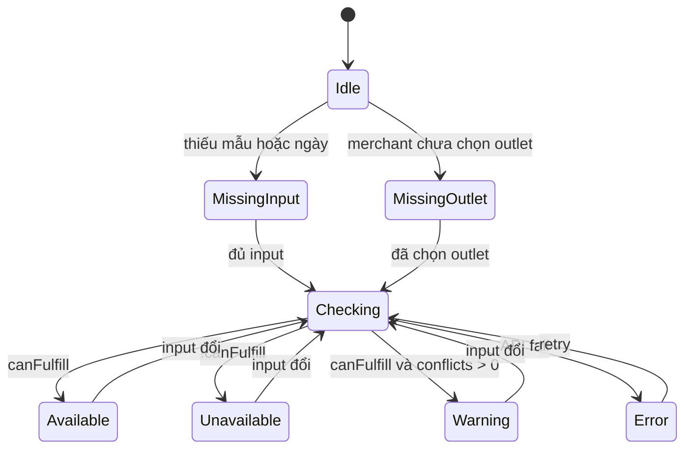

# Client Web — Kiểm tra mẫu còn trống theo ngày thuê

| Field | Value |
|-------|--------|
| **Status** | Implemented (MVP) |
| **App** | `apps/client` |
| **Route** | `/availability` |
| **Permission** | `products.view` |
| **Last updated** | 2026-05-30 |
| **Supersedes** | [.kiro/specs/product-availability-checker/requirements.md](../.kiro/specs/product-availability-checker/requirements.md) (partial — see [§16](#16-thay-đổi-so-với-spec-kiro-cũ)) |

---

## 1. Tóm tắt

Staff cửa hàng thuê đồ thường nhận câu hỏi:

> *“Thứ 6–CN có **váy X size M** không?”*

Câu hỏi thực chất là:

> **Một mẫu cụ thể** có **đủ số lượng trống** trong **kỳ ngày nhận – ngày trả** hay không (sau khi trừ đơn RESERVED/PICKUPED trùng kỳ)?

Hiện tại client chỉ kiểm tra chính xác theo ngày khi **tạo đơn mới** (`CreateOrderForm`). Tính năng này thêm **trang tra cứu độc lập** — không bắt nhập khách, giỏ hàng hay thanh toán.

**Backend:** API availability đã có; **không** cần API mới cho MVP.

---

## 2. Vấn đề & mục tiêu

### 2.1 Vấn đề

| Hiện tại | Hệ quả |
|----------|--------|
| Check theo ngày gắn trong flow tạo đơn | Staff phải mở create order → chọn outlet → thêm SP → chọn ngày |
| Danh sách sản phẩm chỉ hiện `available` / stock tĩnh | Không phản ánh đơn giữ mẫu trong kỳ |
| Lịch (`/calendar`) theo đơn theo ngày | Không trả lời “mẫu X còn trống kỳ Y không” |

### 2.2 Mục tiêu (MVP)

1. Tra **1 mẫu** + **kỳ thuê** + **số lượng** → kết quả **Còn trống** / **Hết** trong **&lt; 30 giây** (thao tác người dùng).
2. Kết quả **khớp logic** badge trên form tạo đơn (cùng API / quy tắc).
3. Hỗ trợ **deep link** (URL) để chia sẻ nội bộ hoặc mở từ trang sản phẩm.
4. **Mobile-first** — staff hay tra khi gọi điện.

### 2.3 Non-goals (MVP)

- Không thay thế tạo đơn, lịch, báo cáo tồn kho.
- Không list “tất cả mẫu còn trống trong ngày” (phase sau nếu có nhu cầu).
- Không check SALE / RENT_TO_OWN (chỉ **RENT**).
- Không barcode scanner native (phase 1.2).

---

## 3. Đối tượng & phân quyền

| Role | Outlet | Hành vi |
|------|--------|---------|
| `OUTLET_ADMIN` | Auto từ JWT | Check trong outlet của mình |
| `OUTLET_STAFF` | Auto từ JWT | Giống trên |
| `MERCHANT` | Phải chọn outlet | Dropdown outlet trước khi có kết quả |
| `ADMIN` | Chọn outlet (nếu dùng client) | Giống merchant |

- Menu & API: permission `products.view`.
- Subscription: không bắt active subscription (giống API availability hiện tại).

---

## 4. Câu hỏi nghiệp vụ (canonical)

```
INPUT:
  - productId (publicId — số hiển thị trên client)
  - pickupDate (YYYY-MM-DD)
  - returnDate (YYYY-MM-DD)
  - quantity (integer ≥ 1, default 1)
  - outletId (publicId — bắt buộc với MERCHANT/ADMIN)

OUTPUT (cho staff trả lời khách):
  - Trạng thái: CÒN TRỐNG | HẾT | CÒN TRỐNG (có đơn trùng kỳ)
  - effectivelyAvailable trong kỳ
  - (tuỳ chọn) danh sách đơn conflict
```

**Size / variant:** Mỗi size là **một product** trong DB (tên/barcode đã phân biệt). Không có model variant riêng trong MVP.

---

## 5. User stories & acceptance criteria

### US-1 — Tra cứu nhanh khi khách hỏi

**Là** outlet staff, **tôi muốn** chọn một mẫu và kỳ thuê, **để** biết còn trống bao nhiêu bộ mà không tạo đơn.

**AC:**

- [ ] Chọn mẫu qua search (tên / mã / barcode).
- [ ] Chọn ngày nhận, ngày trả, số lượng (mặc định 1).
- [ ] Kết quả hiển thị **Còn trống {n} bộ** hoặc **Hết** với kỳ `dd/mm/yyyy – dd/mm/yyyy`.
- [ ] Hiển thị phụ: **Kho** | **Đang thuê** | **Trống trong kỳ**.

### US-2 — Đổi ngày sau khi đã chọn mẫu

**Là** staff, **tôi muốn** chỉ đổi ngày, **để** trả lời “nếu Thứ 7 thôi thì sao?”.

**AC:**

- [ ] Đổi ngày nhận/trả → tự gọi lại API (debounce 300ms), không reload trang.
- [ ] Request cũ bị hủy (`AbortController`) nếu params đổi.

### US-3 — Mở từ trang sản phẩm

**Là** staff, **tôi muốn** bấm “Kiểm tra trống” trên chi tiết SP, **để** không search lại.

**AC:**

- [ ] `/products/[id]` có action → `/availability?productId={id}`.
- [ ] Trang load sẵn card mẫu; focus vào chọn ngày.

### US-4 — Tạo đơn sau khi chốt còn trống

**Là** staff, **tôi muốn** chuyển sang tạo đơn với mẫu + ngày đã chọn, **để** không nhập lại.

**AC:**

- [ ] Nút **Tạo đơn thuê** → `/orders/create` với query pre-fill (xem [§10](#10-url-state--deep-links)).
- [ ] Create order form đọc query và điền outlet (nếu có), mẫu, ngày (implementation create page — có thể phase 1.1).

### US-5 — Xem đơn trùng kỳ (phase 1.1)

**Là** staff, **tôi muốn** xem đơn nào giữ mẫu, **để** gợi ý đổi ngày cho khách.

**AC:**

- [ ] Khi `totalConflictsFound > 0`, section mở rộng: mã đơn, tên khách, nhận–trả, SL.
- [ ] Click mã đơn → `/orders/[id]`.

### US-6 — Sao chép câu trả lời (phase 1.1)

**AC:**

- [ ] Nút copy: `"{productName} còn trống {n} bộ từ {pickup} đến {return}."` hoặc bản **Hết** tương ứng.

---

## 6. Điều hướng & IA

### 6.1 Sidebar (`ClientSidebar`)

Thêm **submenu** dưới **Sản phẩm** (không thêm top-level — giữ sidebar gọn):

```
Sản phẩm ▼
  ├ Tất cả sản phẩm     → /products
  ├ Danh mục            → /categories
  └ Kiểm tra trống      → /availability    ← NEW
```

| Thuộc tính | Giá trị |
|------------|---------|
| Icon | `ClipboardCheck` (lucide-react) |
| i18n key | `navigation.availabilityCheck` |
| VI | Kiểm tra trống |
| EN | Check availability |

### 6.2 Entry points khác

| Vị trí | Action | Phase |
|--------|--------|-------|
| `/dashboard` | Card “Tra cứu mẫu trống” | 1.1 |
| `/products/[id]` | Button “Kiểm tra trống” | 1.1 |
| `/products` row menu | “Kiểm tra trống” | 1.2 |

---

## 7. Cấu trúc trang & layout

### 7.1 File structure (implementation)

```
apps/client/app/availability/page.tsx          # thin page, URL → props

packages/ui/src/components/features/Availability/
  AvailabilityCheckPage.tsx                    # layout + orchestration
  ProductPicker.tsx                            # search + selected card
  RentalPeriodFields.tsx                       # dates + quantity + outlet
  AvailabilityResultPanel.tsx                  # hero Còn/Hết
  ConflictOrdersList.tsx                       # phase 1.1
  useAvailabilityCheck.ts                      # fetch, debounce, abort, URL sync
  index.ts
```

### 7.2 Desktop (≥1024px) — 2 cột

```
┌──────────────────────────────────────────────────────────────────────────┐
│ Breadcrumb: Trang chủ / Kiểm tra trống                                    │
│ Title: Kiểm tra mẫu còn trống                                             │
│ Subtitle: Chọn mẫu và kỳ thuê để trả lời khách                            │
├──────────────────────────────┬───────────────────────────────────────────┤
│ INPUT (≈40%)                  │ RESULT (≈60%)                              │
│                               │                                           │
│ [Outlet ▼]  (merchant/admin)  │  Empty | Loading | Hero | Error            │
│                               │                                           │
│ ── 1. Chọn mẫu ──             │                                           │
│ 🔍 Search combobox            │                                           │
│ [Selected product card]       │                                           │
│                               │                                           │
│ ── 2. Kỳ thuê ──              │                                           │
│ Ngày nhận [date]              │                                           │
│ Ngày trả   [date]             │                                           │
│ Số lượng   [1]                │                                           │
└──────────────────────────────┴───────────────────────────────────────────┘
```

### 7.3 Mobile (&lt;1024px) — 1 cột + sticky result

Thứ tự: Outlet → Search → Selected card → Dates → Qty → **Sticky result panel** (bottom hoặc sau dates, `position: sticky`).

---

## 8. Component spec

### 8.1 `ProductPicker`

| Field | Spec |
|-------|------|
| Search | `productsApi.searchProducts({ search/q, outletId, limit: 10 })`, debounce 300ms |
| Option row | Thumb, name, barcode/SKU, optional static stock |
| Selected | Card: image, name, publicId/code, nút **Đổi mẫu** |
| Empty search | “Không tìm thấy mẫu” |

### 8.2 `RentalPeriodFields`

| Field | Spec |
|-------|------|
| Ngày nhận | `YYYY-MM-DD`, label **Ngày nhận** |
| Ngày trả | `YYYY-MM-DD`, label **Ngày trả** |
| Default return | pickup + 1 ngày nếu return trống (lần chọn pickup đầu) |
| Validation | return &lt; pickup → inline error; pickup quá khứ → warning/error theo API |
| Số lượng | Integer min 1, default 1 |
| Outlet | `Select` chỉ khi `user` không có `outletId` cố định |

Reuse: `DateRangePicker` hoặc pattern date từ `CreateOrderForm`.

### 8.3 `AvailabilityResultPanel`

| State | UI |
|-------|-----|
| `idle` | Illustration + “Chọn mẫu và ngày thuê để xem kết quả” |
| `loading` | Skeleton / spinner + “Đang kiểm tra…” |
| `available` | ✅ **CÒN TRỐNG** — `Còn {n} bộ` · `{pickup} – {return}` |
| `unavailable` | 🚫 **HẾT** — `Cần {qty}, trống {n}` |
| `warning` | ✅ **CÒN TRỐNG** + ⚠ `{k} đơn trùng kỳ` (amber) |
| `error` | Message + **Thử lại** |

**Metrics row (luôn hiện khi có data):**

```
Kho: {totalStock}  ·  Đang thuê: {totalRenting}  ·  Trống trong kỳ: {effectivelyAvailable}
```

**Actions:**

- `Sao chép câu trả lời` (phase 1.1)
- `Tạo đơn thuê →` (phase 1.1 nếu create page chưa đọc query)

### 8.4 `ConflictOrdersList` (phase 1.1)

| Column | Source |
|--------|--------|
| Mã đơn | `conflicts[].orderNumber` → link |
| Khách | `conflicts[].customerName` |
| Nhận – Trả | `pickupDateLocal` – `returnDateLocal` |
| SL | `conflicts[].quantity` |

Collapsed by default nếu `available`; expanded gợi ý nếu `unavailable`.

---

## 9. Logic hiển thị trạng thái

Map từ `ProductAvailabilityResponse` (outlet đang check: `availabilityByOutlet[0]` hoặc outlet khớp `outletId`):

```typescript
const outlet = pickOutletRow(data, outletId);
const effectivelyAvailable =
  outlet?.effectivelyAvailable ?? data.totalAvailableStock ?? 0;
const qty = requestedQuantity;

if (!data.stockAvailable) {
  status = 'unavailable'; // HẾT — kho
} else if (effectivelyAvailable < qty) {
  status = 'unavailable'; // HẾT — kỳ
} else if ((data.totalConflictsFound ?? 0) > 0) {
  status = 'warning';     // CÒN + đơn trùng
} else {
  status = 'available';
}
```

**Đồng bộ với `CreateOrderForm`:** Dùng cùng endpoint và cùng mapping màu/badge (`bg-green-100`, `bg-red-100`, `bg-orange-100`) khi có thể.

---

## 10. URL state & deep links

### 10.1 Query parameters

| Param | Type | Required | Mô tả |
|-------|------|----------|--------|
| `productId` | number | No* | publicId sản phẩm |
| `pickup` | `YYYY-MM-DD` | No* | Ngày nhận |
| `return` | `YYYY-MM-DD` | No* | Ngày trả |
| `qty` | number | No | Default `1` |
| `outletId` | number | No | Bắt buộc logic với merchant |

\*Đủ `productId` + `pickup` + `return` (+ `outletId` nếu cần) → auto-fetch khi mount.

### 10.2 Ví dụ

```
/availability?productId=42&pickup=2026-06-06&return=2026-06-08&qty=1&outletId=1
```

### 10.3 Pre-fill create order (phase 1.1)

```
/orders/create?productId=42&pickupPlanAt=2026-06-06&returnPlanAt=2026-06-08&qty=1&outletId=1&orderType=RENT
```

*(Create page cần đọc query — ticket riêng nếu chưa có.)*

---

## 11. API integration

### 11.1 Endpoint khuyến nghị (MVP — 1 mẫu)

**Primary (đồng bộ `CreateOrderForm`):**

```
GET /api/products/{productId}/availability
```

| Query | Format | Notes |
|-------|--------|-------|
| `startDate` | ISO datetime | `pickup` 00:00:00 local → ISO |
| `endDate` | ISO datetime | `return` 23:59:59 local → ISO |
| `quantity` | number | default 1 |
| `outletId` | number | MERCHANT/ADMIN |
| `includeTimePrecision` | boolean | `true` |
| `timeZone` | string | `UTC` (giống create order) |

**Client:** `productsApi.checkProductAvailability(productId, request)`  
→ `packages/utils/src/api/products.ts`

### 11.2 Endpoint thay thế (đơn giản hơn — optional)

```
GET /api/products/availability?productId=&pickupDate=&returnDate=&outletId=
```

Date dạng `YYYY-MM-DD` — phù hợp UI không cần ISO. Có thể dùng nếu team muốn tránh convert timezone ở client.

**Quyết định implement:** Chọn **một** endpoint; document trong PR. MVP ưu tiên **cùng path với CreateOrderForm** để kết quả nhất quán.

### 11.3 Batch (phase 2 — nhiều mẫu)

```
POST /api/products/batch-availability
```

Chỉ khi có yêu cầu so sánh 2–3 mẫu cùng kỳ; không nằm MVP.

### 11.4 Điều kiện gọi API

Gọi khi:

1. `productId` hợp lệ  
2. `pickup` và `return` hợp lệ (`pickup <= return`)  
3. `outletId` resolved (JWT hoặc user chọn)  
4. `qty >= 1`  

Debounce **300ms** sau thay đổi bất kỳ input trên.

### 11.5 Response fields sử dụng

| Field | UI |
|-------|-----|
| `productName` | Selected card / result |
| `totalStock` | Kho |
| `totalRenting` | Đang thuê |
| `availabilityByOutlet[].effectivelyAvailable` | Trống trong kỳ |
| `totalConflictsFound` | Warning copy |
| `availabilityByOutlet[].conflicts[]` | Conflict list |
| `isAvailable`, `stockAvailable` | Fallback logic |

Tham chiếu test: [`tests/PRODUCT_AVAILABILITY_TEST_CASES.md`](../tests/PRODUCT_AVAILABILITY_TEST_CASES.md)

---

## 12. State machine (page)



---

## 13. i18n

Namespace gợi ý: `availability` (hoặc mở rộng `products`).

| Key | VI | EN |
|-----|----|----|
| `title` | Kiểm tra mẫu còn trống | Check rental availability |
| `subtitle` | Chọn mẫu và kỳ thuê để trả lời khách | Select a product and rental period |
| `pickupDate` | Ngày nhận | Pickup date |
| `returnDate` | Ngày trả | Return date |
| `quantity` | Số lượng | Quantity |
| `searchPlaceholder` | Tìm tên, mã, barcode… | Search name, code, barcode… |
| `status.available` | Còn trống | Available |
| `status.unavailable` | Hết | Not available |
| `stock.total` | Kho | In stock |
| `stock.renting` | Đang thuê | On rent |
| `stock.freeInPeriod` | Trống trong kỳ | Free in period |
| `conflicts.title` | Đơn trùng kỳ | Conflicting orders |
| `actions.copyReply` | Sao chép câu trả lời | Copy reply |
| `actions.createOrder` | Tạo đơn thuê | Create rental order |
| `navigation.availabilityCheck` | Kiểm tra trống | Check availability |

---

## 14. Responsive & accessibility

| Breakpoint | Layout |
|------------|--------|
| &lt;640px | 1 cột, result sticky |
| 640–1023px | 1 cột, result dưới form |
| ≥1024px | 2 cột 40/60 |

- Combobox: keyboard navigation, `aria-expanded`, `aria-activedescendant`.
- Result: `role="status"` + `aria-live="polite"`.
- Màu badge: đạt contrast AA (không chỉ dựa vào màu — có text **Còn trống** / **Hết**).

---

## 15. Lộ trình triển khai

| Phase | Nội dung |
|-------|----------|
| **MVP** | Route, sidebar submenu, picker, dates, qty, outlet, hero result, API single product, URL sync, hook abort/debounce |
| **1.1** | Conflict list, copy reply, product detail + dashboard links, pre-fill create order |
| **1.2** | Barcode, product list row action |
| **2.0** | Multi-product batch compare (nếu product yêu cầu) |

---

## 16. Thay đổi so với spec Kiro cũ

File [`.kiro/specs/product-availability-checker/requirements.md`](../.kiro/specs/product-availability-checker/requirements.md) vẫn tồn tại nhưng **không còn là nguồn chính**. Khác biệt có chủ đích:

| Chủ đề | Kiro cũ | Spec này (canonical) |
|--------|---------|----------------------|
| Vị trí menu | Top-level giữa Calendar & Settings | **Submenu** dưới Sản phẩm |
| Label | "Kiểm tra tồn kho" | **"Kiểm tra trống"** (theo ngày thuê) |
| Focus UX | Nhiều mẫu (≤20), batch-first | **1 mẫu + kỳ ngày** (batch phase 2) |
| Câu hỏi | Inventory-oriented | **"Mẫu X trống kỳ Y?"** |

---

## 17. Testing

### 17.1 Manual test checklist (MVP)

- [ ] Outlet staff: auto outlet, check 1 SP, Còn/Hết đúng với tạo đơn cùng ngày.
- [ ] Merchant: không có kết quả until chọn outlet.
- [ ] Đổi chỉ ngày trả → kết quả cập nhật.
- [ ] URL refresh giữ state.
- [ ] Pickup &gt; return → validation, không gọi API.
- [ ] Mạng lỗi → error + retry.

### 17.2 Automated

- Reuse / mở rộng `tests/product-availability-overlap.test.ts` (API).
- E2E (optional): Playwright flow search → dates → assert badge.

---

## 18. Tài liệu & code liên quan

| Tài liệu / Code | Mô tả |
|-----------------|--------|
| `apps/api/app/api/products/[id]/availability/route.ts` | API chi tiết (ISO dates) |
| `apps/api/app/api/products/availability/route.ts` | API query `pickupDate`/`returnDate` |
| `apps/api/app/api/products/batch-availability/route.ts` | Batch (phase 2) |
| `packages/ui/.../CreateOrderForm/` | Logic & badge tham chiếu |
| `packages/ui/.../product-availability-async-display.tsx` | Component badge |
| `packages/hooks/.../useProductAvailability.ts` | Client-side calc — **không dùng** cho trang mới |
| `tests/PRODUCT_AVAILABILITY_TEST_CASES.md` | Test cases overlap |

---

## 19. Implementation checklist (dev)

- [x] `docs/CLIENT_AVAILABILITY_CHECK_SPEC.md` (file này) — reviewed
- [x] i18n keys `vi` / `en` (và locale khác fallback EN)
- [x] `apps/client/app/availability/page.tsx`
- [x] Feature components `@rentalshop/ui` + export `index`
- [x] `ClientSidebar` submenu item
- [x] `useAvailabilityCheck` + URL sync
- [x] API: `GET /api/products/{id}/availability` via `productsApi.checkProductAvailability`
- [x] Product detail entry (`/products/[id]`)
- [ ] Phase 1.1: dashboard card, create order query pre-fill

---

## 20. Changelog

| Date | Change |
|------|--------|
| 2026-05-30 | Initial spec — single-product focus, submenu nav, API reuse, UI wireframes |
