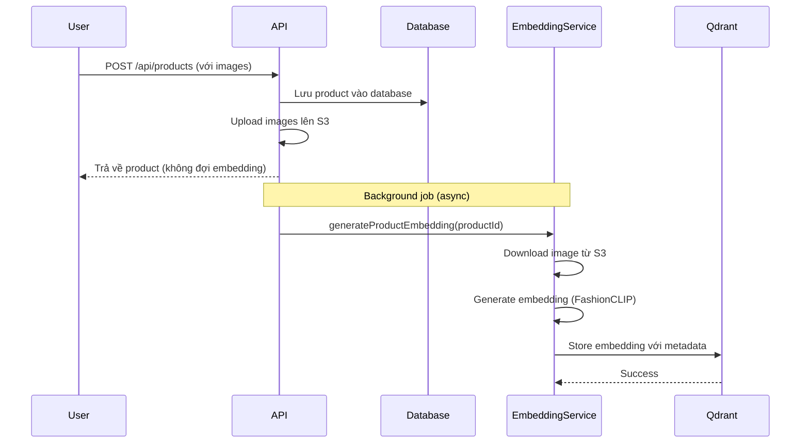
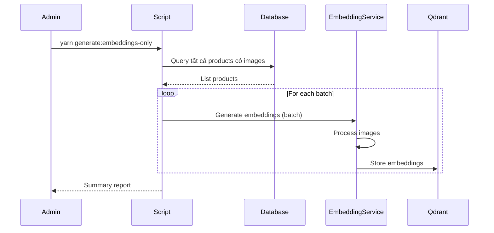

# Image Search Embedding Strategy - Chi Tiết & Chi Phí

## Tổng Quan

Hệ thống Image Search sử dụng **FashionCLIP model** (self-hosted) để tạo embeddings cho hình ảnh sản phẩm. Có **2 phương án** để generate embeddings:

1. **Auto-generate khi tạo sản phẩm** (Real-time)
2. **Batch generate cho products cũ** (Background job)

---

## Phương Án 1: Auto-Generate Embedding Khi Tạo Sản Phẩm

### Cách Hoạt Động



### Implementation Hiện Tại

**File:** `apps/api/app/api/products/route.ts` (line 507-519)

```typescript
// Generate embedding for image search (background job)
if (committedImageUrls.length > 0) {
  try {
    const { generateProductEmbedding } = await import('@rentalshop/database/server');
    // Run in background (don't block response)
    generateProductEmbedding(product.id).catch((error) => {
      console.error(`Error generating embedding for product ${product.id}:`, error);
    });
  } catch (error) {
    console.error('Error starting embedding generation:', error);
    // Don't fail the request if embedding generation fails
  }
}
```

### Đặc Điểm

**Ưu điểm:**
- ✅ **Tự động** - Không cần can thiệp thủ công
- ✅ **Real-time** - Embedding được tạo ngay sau khi product được tạo
- ✅ **Không block response** - Chạy background, không làm chậm API
- ✅ **Error handling** - Lỗi không ảnh hưởng đến product creation
- ✅ **Scalable** - Có thể xử lý nhiều products đồng thời

**Nhược điểm:**
- ⚠️ **Latency** - Embedding có thể mất 2-5 giây để generate
- ⚠️ **Resource usage** - Tốn CPU/RAM khi generate (nhưng không block API)
- ⚠️ **First-time delay** - Model download lần đầu (~500MB, chỉ 1 lần)

### Chi Phí

**Self-Hosted FashionCLIP Model:**
- ✅ **$0 per request** - Model chạy trên server của bạn
- ✅ **$0 API costs** - Không cần gọi external API
- ✅ **Chỉ tốn server resources** - CPU/RAM (đã có sẵn)

**Chi phí thực tế:**
- **Embedding generation:** $0 (self-hosted)
- **Storage (Qdrant):** 
  - Local: $0
  - Railway self-hosted: ~$5-10/month (tùy usage)
  - Qdrant Cloud: Free tier hoặc $25+/month
- **S3 storage:** Đã có sẵn (không tăng chi phí)
- **Network bandwidth:** Minimal (chỉ download image 1 lần)

**Tổng chi phí cho auto-generate:**
- **Local development:** $0
- **Railway dev (self-hosted Qdrant):** ~$5-10/month
- **Railway dev (Qdrant Cloud):** $0-25/month (tùy plan)

### Performance

- **Time per embedding:** 1-3 giây (tùy image size)
- **Concurrent processing:** Có thể xử lý nhiều products đồng thời
- **Model size:** ~500MB (download 1 lần, cache sau đó)
- **Memory usage:** ~200-500MB khi generate

### Khi Nào Dùng

- ✅ **Sản phẩm mới** - Tự động generate khi tạo
- ✅ **Production** - Đảm bảo mọi product mới đều có embedding
- ✅ **Real-time search** - Có thể search ngay sau khi tạo

---

## Phương Án 2: Batch Generate Embedding Cho Products Cũ

### Cách Hoạt Động



### Implementation Hiện Tại

**File:** `packages/database/src/jobs/generate-product-embeddings.ts`

**Function:** `generateAllProductEmbeddings(options)`

```typescript
export async function generateAllProductEmbeddings(
  options: {
    merchantId?: number;
    batchSize?: number;
    skipExisting?: boolean;
  } = {}
): Promise<void> {
  // Fetch all products with images
  // Process in batches
  // Generate embeddings
  // Store in Qdrant
}
```

**Script:** `scripts/generate-embeddings-only.ts`

**Command:**
```bash
yarn generate:embeddings-only
```

### Đặc Điểm

**Ưu điểm:**
- ✅ **Batch processing** - Xử lý nhiều products cùng lúc
- ✅ **Efficient** - Có thể optimize batch size
- ✅ **Flexible** - Có thể filter theo merchantId
- ✅ **Skip existing** - Có thể skip products đã có embedding
- ✅ **Progress tracking** - Hiển thị progress khi chạy

**Nhược điểm:**
- ⚠️ **Manual trigger** - Cần chạy script thủ công
- ⚠️ **Time consuming** - Mất thời gian cho nhiều products
- ⚠️ **One-time** - Chỉ chạy khi cần migrate data cũ

### Chi Phí

**Self-Hosted FashionCLIP Model:**
- ✅ **$0 per request** - Model chạy trên server của bạn
- ✅ **$0 API costs** - Không cần gọi external API

**Chi phí thực tế:**
- **Embedding generation:** $0 (self-hosted)
- **Storage (Qdrant):** 
  - Local: $0
  - Railway self-hosted: ~$5-10/month
  - Qdrant Cloud: Free tier hoặc $25+/month
- **Server resources:** CPU/RAM trong thời gian chạy script
- **Time cost:** 5-10 phút cho 100 products

**Tổng chi phí cho batch generation:**
- **Local development:** $0
- **Railway dev:** ~$5-10/month (Qdrant storage)
- **One-time processing:** $0 (chỉ tốn thời gian)

### Performance

- **Time per product:** 1-3 giây
- **Batch size:** 10 products/batch (có thể tùy chỉnh)
- **Total time:** 
  - 100 products: ~5-10 phút
  - 1000 products: ~50-100 phút
  - 10000 products: ~8-16 giờ

### Khi Nào Dùng

- ✅ **Migration** - Chuyển products cũ sang Qdrant
- ✅ **Backfill** - Generate embeddings cho products thiếu
- ✅ **Re-indexing** - Cập nhật lại embeddings sau khi update model

---

## So Sánh Chi Phí

### Bảng So Sánh

| Aspect | Auto-Generate | Batch Generate |
|--------|---------------|----------------|
| **Chi phí embedding** | $0 (self-hosted) | $0 (self-hosted) |
| **Chi phí Qdrant** | $0-25/month | $0-25/month |
| **Chi phí API** | $0 | $0 |
| **Chi phí storage** | Đã có sẵn | Đã có sẵn |
| **Tổng chi phí** | **$0-25/month** | **$0-25/month** |
| **Time per product** | 1-3 giây | 1-3 giây |
| **Automation** | ✅ Tự động | ❌ Manual |
| **Use case** | Products mới | Products cũ |

### Chi Phí Chi Tiết Theo Environment

#### Local Development
- **Qdrant:** Local Docker (free)
- **Embedding:** Self-hosted (free)
- **Total:** **$0/month**

#### Railway Development (Self-hosted Qdrant)
- **Qdrant:** Railway service (~$5-10/month)
- **Embedding:** Self-hosted (free)
- **Total:** **~$5-10/month**

#### Railway Development (Qdrant Cloud)
- **Qdrant Cloud:** Free tier (1GB) hoặc Starter ($25/month)
- **Embedding:** Self-hosted (free)
- **Total:** **$0-25/month**

#### Production (Qdrant Cloud)
- **Qdrant Cloud:** Starter ($25/month) hoặc Professional ($100+/month)
- **Embedding:** Self-hosted (free)
- **Total:** **$25-100+/month**

---

## Tương Lai - Roadmap

### Phase 1: Development (Hiện tại) ✅

**Setup:**
- ✅ Auto-generate embedding khi tạo product
- ✅ Background job không block API
- ✅ Error handling

**Chi phí:** $0-10/month (local hoặc Railway dev)

### Phase 2: Migration Products Cũ (Sắp tới)

**Action:**
```bash
# Chạy batch script để generate embeddings cho products cũ
yarn generate:embeddings-only
```

**Timeline:**
- Chạy 1 lần khi cần migrate
- Có thể chạy lại nếu cần re-index

**Chi phí:** $0 (one-time, chỉ tốn thời gian)

### Phase 3: Production (Tương lai)

**Setup:**
- Auto-generate cho products mới (đã có)
- Qdrant Cloud hoặc self-hosted trên Railway
- Monitoring và alerting

**Chi phí:** $25-100+/month (tùy scale)

### Phase 4: Optimization (Tương lai xa)

**Improvements:**
- Caching embeddings
- Batch processing optimization
- Model fine-tuning (nếu cần)
- Multi-model ensemble

**Chi phí:** Giữ nguyên hoặc tăng nhẹ ($25-150/month)

---

## Recommendation

### Cho Development (Hiện tại)

**Setup:**
1. ✅ **Auto-generate** - Đã implement, hoạt động tốt
2. ⏳ **Batch script** - Sẵn sàng, chạy khi cần
3. ⏳ **Qdrant trên Railway** - Setup khi test Railway dev

**Chi phí:** $0-10/month

### Cho Railway Development

**Option A: Self-hosted Qdrant trên Railway** (Recommended)
- Deploy Qdrant container trên Railway
- Chi phí: ~$5-10/month
- Full control, dễ debug

**Option B: Qdrant Cloud Free Tier**
- Đăng ký Qdrant Cloud
- Chi phí: $0 (1GB free)
- Managed service, ít phải quản lý

**Recommendation:** **Option A** - Self-hosted trên Railway
- Chi phí thấp
- Dễ debug
- Production-like environment

### Cho Production

**Setup:**
- Qdrant Cloud Starter ($25/month) hoặc Professional
- Auto-generate embedding (đã có)
- Monitoring và alerting

**Chi phí:** $25-100+/month (tùy scale)

---

## Migration Plan Cho Products Cũ

### Step 1: Verify Setup

```bash
# 1. Check Qdrant connection
curl http://localhost:6333/health

# 2. Check collection exists
# Mở Qdrant dashboard: http://localhost:6333/dashboard
```

### Step 2: Run Batch Script

```bash
# Generate embeddings cho tất cả products có images
yarn generate:embeddings-only

# Hoặc filter theo merchant
# (cần update script để support merchantId filter)
```

### Step 3: Verify Results

```bash
# Check Qdrant dashboard
# POINTS count should match number of products with images
```

### Step 4: Test Search

```bash
# Test image search với products đã có embedding
yarn test:image-search test-images/product1.jpg
```

---

## Cost Breakdown Example

### Scenario: 1000 Products với Images

#### Setup Costs
- **Model download:** $0 (one-time, ~500MB)
- **Qdrant setup:** $0 (local) hoặc $5-10/month (Railway)

#### Per-Product Costs
- **Embedding generation:** $0 (self-hosted)
- **Storage per embedding:** ~2KB
- **Total storage:** ~2MB cho 1000 embeddings

#### Monthly Costs
- **Local:** $0
- **Railway dev (self-hosted):** ~$5-10/month
- **Railway dev (Qdrant Cloud free):** $0
- **Production (Qdrant Cloud):** $25+/month

#### One-Time Migration
- **Time:** ~50-100 phút cho 1000 products
- **Cost:** $0 (chỉ tốn thời gian)

---

## Summary

### Auto-Generate (Phương án 1)
- ✅ **Đã implement** - Hoạt động tự động
- ✅ **Chi phí:** $0-25/month (tùy Qdrant setup)
- ✅ **Use case:** Products mới
- ✅ **Recommendation:** Giữ nguyên, không cần thay đổi

### Batch Generate (Phương án 2)
- ✅ **Đã có script** - Sẵn sàng sử dụng
- ✅ **Chi phí:** $0 (one-time)
- ✅ **Use case:** Products cũ, migration
- ✅ **Recommendation:** Chạy khi cần migrate products cũ

### Tổng Chi Phí
- **Development:** $0-10/month
- **Production:** $25-100+/month (tùy scale)
- **Migration:** $0 (one-time, chỉ tốn thời gian)

### Next Steps
1. ✅ Auto-generate đã hoạt động - Không cần thay đổi
2. ⏳ Setup Qdrant trên Railway dev
3. ⏳ Chạy batch script cho products cũ (khi cần)
4. ⏳ Test trên Railway development environment

---

**Last Updated:** 2025-01-22  
**Status:** Ready for Railway deployment
