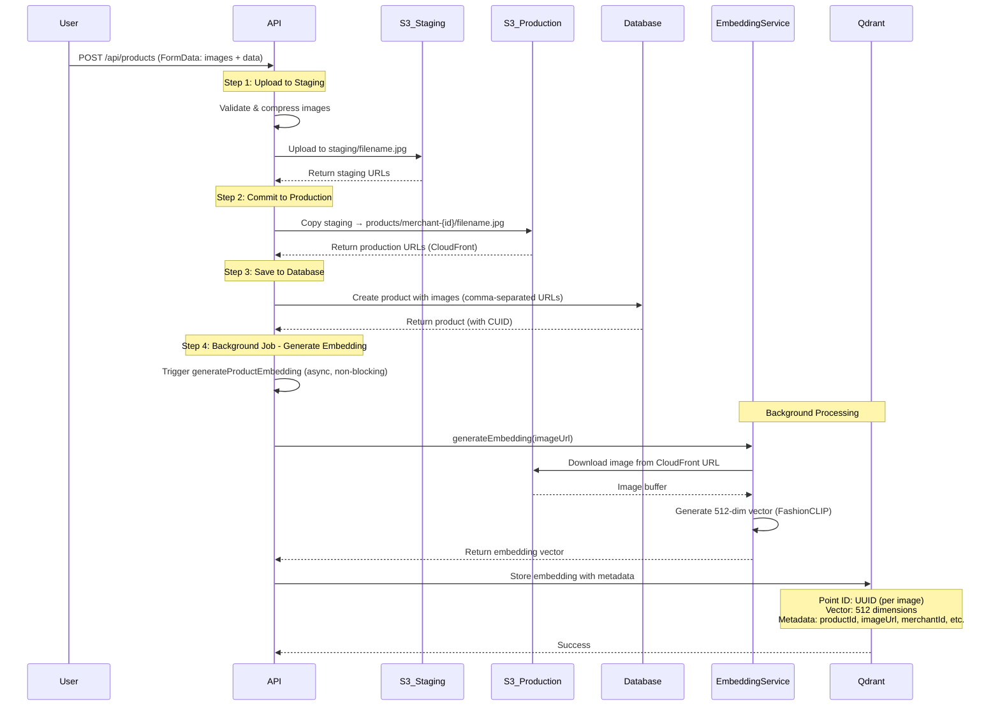

# Image Upload to Embedding Flow - Chi Tiết

## Tổng Quan

Document này giải thích chi tiết flow từ khi user upload hình ảnh sản phẩm đến khi embedding được lưu vào Qdrant, bao gồm:
1. Upload hình ảnh lên S3 (staging)
2. Commit từ staging sang production
3. Lưu URLs vào database
4. Generate embedding từ image URLs
5. Lưu embedding vào Qdrant với metadata

---

## Flow Diagram



---

## Chi Tiết Từng Bước

### Step 1: Upload Hình Ảnh Lên S3 Staging

**File:** `apps/api/app/api/products/route.ts` (line 221-260)

**Process:**
1. **Validate image:**
   - File type: JPEG, PNG, WebP
   - File size: Max 5MB
   - Dimensions: Max 4000x4000px

2. **Compress image:**
   - Resize nếu > 1MB
   - Convert về JPEG format
   - Optimize quality

3. **Generate filename:**
   - Format: `product-image-{timestamp}-{randomId}.jpg`
   - Example: `product-image-1705924800000-abc123def456.jpg`

4. **Upload to S3 staging:**
   - **S3 Key:** `staging/product-image-{timestamp}-{randomId}.jpg`
   - **S3 Bucket:** `anyrent-images-dev` (development) hoặc `anyrent-images-pro` (production)
   - **Content Type:** `image/jpeg`
   - **URL:** `https://{bucket}.s3.{region}.amazonaws.com/staging/...`

**Code:**
```typescript
// Upload to staging
const stagingKey = generateStagingKey(fileName);
// Result: staging/product-image-1705924800000-abc123def456.jpg

const uploadResult = await uploadToS3(buffer, {
  folder: 'staging',
  fileName: finalFileName,
  contentType: 'image/jpeg'
});

// Returns: staging URLs
// https://anyrent-images-dev.s3.ap-southeast-1.amazonaws.com/staging/product-image-...
```

**Storage Location:**
- **S3 Bucket:** `anyrent-images-dev` hoặc `anyrent-images-pro`
- **S3 Key:** `staging/product-image-{timestamp}-{randomId}.jpg`
- **URL:** S3 URL hoặc CloudFront URL (nếu có)

---

### Step 2: Commit Từ Staging Sang Production

**File:** `apps/api/app/api/products/route.ts` (line 265-302)

**Process:**
1. **Extract staging keys** từ URLs
2. **Generate production key:**
   - Format: `products/merchant-{merchantId}/product-image-{timestamp}-{randomId}.jpg`
   - Example: `products/merchant-1/product-image-1705924800000-abc123def456.jpg`

3. **Copy từ staging sang production:**
   - S3 CopyObject operation
   - Source: `staging/product-image-...`
   - Destination: `products/merchant-{id}/product-image-...`

4. **Generate production URLs:**
   - CloudFront URL: `https://{cloudfront-domain}/products/merchant-{id}/...`
   - Fallback: S3 URL nếu không có CloudFront

**Code:**
```typescript
// Commit staging to production
const productionKey = generateProductImageKey(merchantId, fileName);
// Result: products/merchant-1/product-image-1705924800000-abc123def456.jpg

const commitResult = await commitStagingFiles(stagingKeys, targetFolder);

// Generate CloudFront URLs
const productionUrls = commitResult.committedKeys.map(key => 
  `https://${cloudfrontDomain}/${key}`
);
// Result: https://d1234567890.cloudfront.net/products/merchant-1/product-image-...
```

**Storage Location:**
- **S3 Bucket:** `anyrent-images-dev` hoặc `anyrent-images-pro`
- **S3 Key:** `products/merchant-{merchantId}/product-image-{timestamp}-{randomId}.jpg`
- **URL:** CloudFront URL (production) hoặc S3 URL (fallback)

**S3 Folder Structure:**
```
anyrent-images-dev/
├── staging/
│   └── product-image-1705924800000-abc123def456.jpg (temporary)
└── products/
    └── merchant-1/
        └── product-image-1705924800000-abc123def456.jpg (permanent)
```

---

### Step 3: Lưu URLs Vào Database

**File:** `apps/api/app/api/products/route.ts` (line 473-495)

**Process:**
1. **Combine images:**
   - Merge existing images (nếu có) với new images
   - Remove duplicates

2. **Format for database:**
   - Convert array thành comma-separated string
   - Example: `"https://cdn.example.com/image1.jpg,https://cdn.example.com/image2.jpg"`

3. **Save to database:**
   - Field: `images` (String)
   - Format: Comma-separated URLs
   - Table: `Product`

**Code:**
```typescript
// Combine images
const committedImageUrls = await commitProductImages(imageUrls, uploadedStagingKeys, merchantId);
// Result: ["https://cdn.example.com/image1.jpg", "https://cdn.example.com/image2.jpg"]

// Format for database
const imagesValue = committedImageUrls.length > 0 
  ? committedImageUrls.join(',')
  : '';
// Result: "https://cdn.example.com/image1.jpg,https://cdn.example.com/image2.jpg"

// Save to database
const product = await db.products.create({
  name: parsed.data.name,
  images: imagesValue, // Comma-separated string
  merchantId: merchant.id,
  // ... other fields
});
```

**Database Storage:**
- **Table:** `Product`
- **Field:** `images` (String, nullable)
- **Format:** Comma-separated URLs
- **Example:** `"https://d1234567890.cloudfront.net/products/merchant-1/image1.jpg,https://d1234567890.cloudfront.net/products/merchant-1/image2.jpg"`

---

### Step 4: Generate Embedding (Background Job)

**File:** `apps/api/app/api/products/route.ts` (line 507-519)

**Process:**
1. **Trigger background job:**
   - Non-blocking (không đợi kết quả)
   - Chạy async sau khi product được tạo
   - Lỗi không ảnh hưởng đến product creation

2. **Background job function:**
   - File: `packages/database/src/jobs/generate-product-embeddings.ts`
   - Function: `generateProductEmbedding(productId)`

**Code:**
```typescript
// Generate embedding for image search (background job)
if (committedImageUrls.length > 0) {
  try {
    const { generateProductEmbedding } = await import('@rentalshop/database/server');
    // Run in background (don't block response)
    generateProductEmbedding(product.id).catch((error) => {
      console.error(`Error generating embedding for product ${product.id}:`, error);
    });
  } catch (error) {
    console.error('Error starting embedding generation:', error);
    // Don't fail the request if embedding generation fails
  }
}
```

**Timing:**
- **Trigger:** Ngay sau khi product được tạo
- **Execution:** Background (async)
- **Duration:** 1-3 giây per image
- **Non-blocking:** API response không đợi embedding generation

---

### Step 5: Download Image & Generate Embedding

**File:** `packages/database/src/jobs/generate-product-embeddings.ts` (line 39-111)

**Process:**
1. **Fetch product từ database:**
   - Get product by ID
   - Parse images từ comma-separated string

2. **Download images:**
   - Fetch từ CloudFront URLs
   - Convert to buffer

3. **Generate embedding:**
   - Model: FashionCLIP (`Xenova/clip-vit-base-patch32`)
   - Input: Image buffer
   - Output: 512-dimension vector (normalized)

4. **Create metadata:**
   - `productId`: Product ID
   - `imageUrl`: CloudFront URL
   - `merchantId`: Merchant ID
   - `categoryId`: Category ID (optional)
   - `productName`: Product name

**Code:**
```typescript
// Fetch product
const product = await db.products.findById(productId);
const images = parseProductImages(product.images);
// Result: ["https://cdn.example.com/image1.jpg", "https://cdn.example.com/image2.jpg"]

// Generate embeddings for all images
const embeddings = await Promise.all(
  images.map(async (imageUrl, index) => {
    // Download image from CloudFront URL
    const embedding = await embeddingService.generateEmbedding(imageUrl);
    // Result: [0.123, -0.456, 0.789, ...] (512 dimensions)
    
    return {
      imageId: randomUUID(), // UUID cho mỗi image
      embedding, // 512-dim vector
      metadata: {
        productId: String(product.id),
        imageUrl,
        merchantId: String(product.merchantId),
        categoryId: product.categoryId ? String(product.categoryId) : undefined,
        productName: product.name
      }
    };
  })
);
```

**Embedding Details:**
- **Model:** FashionCLIP (`Xenova/clip-vit-base-patch32`)
- **Dimension:** 512
- **Format:** Float32 array (normalized)
- **Size:** ~2KB per embedding
- **Time:** 1-3 giây per image

---

### Step 6: Lưu Embedding Vào Qdrant

**File:** `packages/database/src/ml/vector-store.ts` (line 313-343)

**Process:**
1. **Create points:**
   - **Point ID:** UUID (mỗi image có UUID riêng)
   - **Vector:** 512-dimension embedding
   - **Payload:** Metadata (productId, imageUrl, merchantId, etc.)

2. **Store in Qdrant:**
   - Collection: `product-images`
   - Operation: `upsert` (create or update)
   - Batch operation (nếu có nhiều images)

**Code:**
```typescript
// Store embeddings in Qdrant
await vectorStore.storeProductImagesEmbeddings(validEmbeddings);

// Internal implementation:
const points = embeddings.map(({ imageId, embedding, metadata }) => ({
  id: imageId, // UUID: "a1b2c3d4-e5f6-7890-abcd-ef1234567890"
  vector: embedding, // [0.123, -0.456, 0.789, ...] (512 dims)
  payload: {
    productId: String(metadata.productId), // "123"
    imageUrl: metadata.imageUrl, // "https://cdn.example.com/image1.jpg"
    merchantId: String(metadata.merchantId), // "1"
    categoryId: metadata.categoryId ? String(metadata.categoryId) : undefined,
    productName: metadata.productName, // "Product Name"
    updatedAt: new Date().toISOString() // "2025-01-22T10:30:00.000Z"
  }
}));

await this.client.upsert('product-images', { points });
```

**Qdrant Storage:**
- **Collection:** `product-images`
- **Point ID:** UUID (unique per image)
- **Vector:** 512 dimensions (Float32)
- **Distance Metric:** Cosine similarity
- **Payload:**
  - `productId`: String
  - `imageUrl`: String (CloudFront URL)
  - `merchantId`: String
  - `categoryId`: String (optional)
  - `productName`: String
  - `updatedAt`: ISO timestamp

**Storage Size:**
- **Vector:** 512 × 4 bytes = 2,048 bytes = 2KB
- **Metadata:** ~300-500 bytes
- **Total per point:** ~2.5KB
- **1GB Qdrant Cloud:** ~400,000 points (~200,000 products với 2 images/product)

---

## Data Flow Summary

### 1. Image Upload Flow

```
User Upload
  ↓
Validate & Compress
  ↓
S3 Staging: staging/filename.jpg
  ↓
S3 Production: products/merchant-{id}/filename.jpg
  ↓
CloudFront URL: https://cdn.example.com/products/merchant-{id}/filename.jpg
  ↓
Database: images = "url1,url2,url3"
```

### 2. Embedding Generation Flow

```
Product Created
  ↓
Background Job Triggered
  ↓
Parse Images from Database
  ↓
Download Images from CloudFront
  ↓
Generate Embedding (FashionCLIP)
  ↓
Qdrant: Store embedding + metadata
```

### 3. Storage Locations

| Data | Location | Format | Size |
|------|----------|--------|------|
| **Images** | S3 + CloudFront | JPEG | ~100KB-1MB per image |
| **Image URLs** | PostgreSQL | Comma-separated string | ~200-500 bytes |
| **Embeddings** | Qdrant Cloud | 512-dim vector | ~2.5KB per embedding |
| **Metadata** | Qdrant Cloud | JSON payload | ~300-500 bytes per point |

---

## Example: Complete Flow

### Input: User Uploads Product

```typescript
// POST /api/products
FormData:
  - data: { name: "iPhone 15", merchantId: 1, ... }
  - images: [File1.jpg, File2.jpg]
```

### Step 1: Upload to Staging

```typescript
// S3 Staging
staging/product-image-1705924800000-abc123.jpg
staging/product-image-1705924800000-def456.jpg

// URLs
https://anyrent-images-dev.s3.ap-southeast-1.amazonaws.com/staging/product-image-...
```

### Step 2: Commit to Production

```typescript
// S3 Production
products/merchant-1/product-image-1705924800000-abc123.jpg
products/merchant-1/product-image-1705924800000-def456.jpg

// CloudFront URLs
https://d1234567890.cloudfront.net/products/merchant-1/product-image-1705924800000-abc123.jpg
https://d1234567890.cloudfront.net/products/merchant-1/product-image-1705924800000-def456.jpg
```

### Step 3: Save to Database

```sql
-- Product table
INSERT INTO Product (
  name,
  images,
  merchantId,
  ...
) VALUES (
  'iPhone 15',
  'https://d1234567890.cloudfront.net/products/merchant-1/product-image-1705924800000-abc123.jpg,https://d1234567890.cloudfront.net/products/merchant-1/product-image-1705924800000-def456.jpg',
  1,
  ...
);
```

### Step 4: Generate Embeddings

```typescript
// Background job
generateProductEmbedding(productId: 123)

// For each image:
// 1. Download from CloudFront
// 2. Generate embedding: [0.123, -0.456, 0.789, ...] (512 dims)
// 3. Create metadata
```

### Step 5: Store in Qdrant

```json
// Qdrant Collection: product-images
{
  "id": "a1b2c3d4-e5f6-7890-abcd-ef1234567890", // UUID
  "vector": [0.123, -0.456, 0.789, ...], // 512 dimensions
  "payload": {
    "productId": "123",
    "imageUrl": "https://d1234567890.cloudfront.net/products/merchant-1/product-image-1705924800000-abc123.jpg",
    "merchantId": "1",
    "productName": "iPhone 15",
    "updatedAt": "2025-01-22T10:30:00.000Z"
  }
}
```

---

## Key Points

### 1. Two-Phase Upload Pattern

- **Staging:** Temporary storage, có thể rollback
- **Production:** Permanent storage, organized by merchant

### 2. Background Embedding Generation

- **Non-blocking:** API response không đợi embedding
- **Async:** Chạy sau khi product được tạo
- **Error handling:** Lỗi không ảnh hưởng product creation

### 3. Multiple Images Support

- **Database:** Comma-separated URLs
- **Qdrant:** Mỗi image = 1 point (UUID riêng)
- **Metadata:** Cùng productId, khác imageUrl

### 4. Storage Optimization

- **S3:** Images (JPEG, compressed)
- **Database:** URLs only (không lưu binary)
- **Qdrant:** Embeddings only (vectors, không lưu images)

---

## Troubleshooting

### Images không upload được

**Check:**
1. S3 credentials (AWS_ACCESS_KEY_ID, AWS_SECRET_ACCESS_KEY)
2. S3 bucket name (AWS_S3_BUCKET_NAME)
3. File size (max 5MB)
4. File type (JPEG, PNG, WebP)

### Embeddings không được generate

**Check:**
1. Qdrant connection (QDRANT_URL, QDRANT_API_KEY)
2. Image URLs accessible (CloudFront working)
3. Background job logs
4. Model download (FashionCLIP ~500MB, first time only)

### Qdrant storage issues

**Check:**
1. Collection exists (`product-images`)
2. Storage usage (< 1GB for free tier)
3. Point count (should match number of images)
4. Metadata format (Unicode issues)

---

**Last Updated:** 2025-01-22  
**Status:** Complete flow documentation
