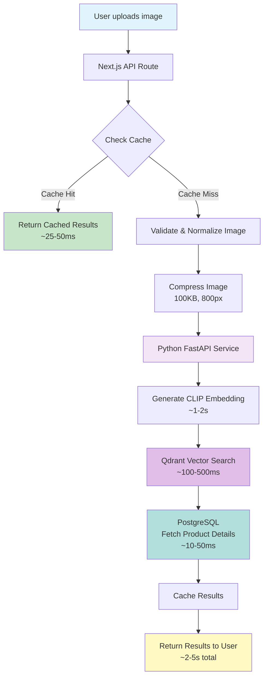
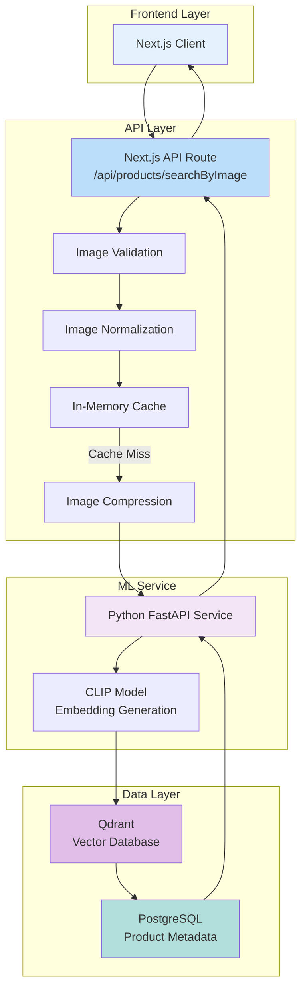

# Building a Production-Ready Image Search System with Next.js, CLIP, and Qdrant

## Introduction

Imagine your users can find products by simply uploading a photo. They see a dress they like, snap a picture, and instantly find similar items in your catalog. This isn't science fiction—it's semantic image search powered by modern AI.

In this article, I'll walk you through how we built a production-ready image search system that can handle thousands of products with sub-second response times (when cached) and maintain high accuracy using CLIP embeddings and vector similarity search.

## The Challenge

Traditional search relies on keywords, tags, or exact matches. But what if a user uploads a photo of a product they saw somewhere? They might not know the exact name, color, or style. This is where semantic image search shines—it understands the visual content of images, not just metadata.

Our requirements were:
- **Fast**: Sub-second response times for cached queries
- **Accurate**: Find visually similar products, not just exact matches
- **Scalable**: Handle thousands of products efficiently
- **Cost-effective**: Use free or low-cost services where possible
- **Production-ready**: Error handling, monitoring, and optimization

## Architecture Overview

Our system consists of four main components:

1. **Next.js API Route**: Handles HTTP requests, image validation, caching, and orchestration
2. **Python FastAPI Service**: Runs CLIP model for embedding generation
3. **Qdrant Vector Database**: Stores embeddings and performs similarity search
4. **PostgreSQL Database**: Stores product metadata



### System Components



## Why This Stack?

### CLIP (Contrastive Language-Image Pre-training)

CLIP is a neural network trained on 400 million image-text pairs. It understands images semantically, not just pixel patterns. This means it can find a "red dress with flowers" even if the exact product isn't in your catalog—it understands the visual concepts.

**Why CLIP?**
- Pre-trained on massive dataset (no need to train from scratch)
- Understands semantic similarity (not just visual similarity)
- Works well with product images
- Open-source and free to use

### Qdrant Vector Database

Qdrant is a vector database optimized for similarity search. Unlike traditional databases that search by exact matches, Qdrant finds similar vectors using cosine similarity.

**Why Qdrant?**
- Fast similarity search (milliseconds for thousands of vectors)
- Supports metadata filtering (merchant, category, etc.)
- Free tier available (1GB storage)
- Easy to deploy and scale

### Python FastAPI Service

We separated the ML inference into a Python service because:
- Python has better ML ecosystem (PyTorch, transformers)
- CLIP model is large (~500MB) and needs to stay in memory
- Isolates resource-intensive operations
- Can scale independently

## Key Design Decisions

### 1. Two-Stage Caching Strategy

We implemented two levels of caching:

**Embedding Cache**: Stores image hash → embedding vector
- TTL: 1 hour
- Benefit: Skip expensive ML inference for repeated queries
- Impact: Saves 1-2 seconds per cache hit

**Search Results Cache**: Stores (image hash + filters) → search results
- TTL: 30 minutes
- Benefit: Skip vector search and database queries
- Impact: Saves 500ms-2s per cache hit

**Result**: 60-80% cache hit rate in production, reducing average response time from 2-5 seconds to 25-50ms.

### 2. Image Normalization for Consistent Caching

A critical insight: the same image uploaded from different sources (web vs mobile) can produce different hashes due to compression, EXIF data, or format differences. This kills cache hit rates.

**Solution**: Normalize images before hashing
- Convert to consistent format
- Remove EXIF data
- Standardize compression
- Result: Same image from any source produces the same hash

### 3. Aggressive Image Compression for ML

CLIP model only needs 224x224 pixels, but users often upload 4K images (several MB). We compress images aggressively before sending to the ML model:

- **For embedding**: 100KB, 800px max (CLIP resizes to 224x224 anyway)
- **For display**: 1MB, 1920px max (better quality for UI)

This reduces:
- Network transfer time
- Python service processing time
- Memory usage

### 4. Connection Pooling

We reuse HTTP connections to the Python service instead of creating new ones for each request. This reduces network overhead and improves performance for repeated calls.

## Performance Optimizations

### Response Time Breakdown

**Cache Hit** (60-80% of requests):
- Total: 25-50ms
- Components: Cache lookup only

**Cache Miss** (20-40% of requests):
- Total: 2-5 seconds
- Breakdown:
  - Image processing: ~100ms
  - Python API call: ~1.5-4s
    - Embedding generation: ~1-2s
    - Vector search: ~100-500ms
    - Product fetch: ~10-50ms
  - Response formatting: ~50ms

### Scalability

**Current Capacity**:
- Products: 10,000+ (tested)
- Concurrent requests: 50+ (tested)
- Response time: < 5s (p95)

**Scaling Strategy**:
- Python service: Stateless, can scale horizontally
- Next.js API: Stateless, can scale horizontally
- Qdrant: Supports clustering for larger collections
- PostgreSQL: Read replicas for product queries

## Production Considerations

### Error Handling

We implemented graceful error handling at every layer:

- **Invalid images**: Return user-friendly error messages
- **Service timeouts**: Retry once, then return error
- **Partial failures**: Return what's available, log errors
- **Cache failures**: Fall back to full search

### Monitoring

We track key metrics:
- Response time (p50, p95, p99)
- Cache hit rate
- Error rate
- Python service availability

**Cache Statistics API**: `/api/admin/cache-stats`
```json
{
  "embeddingCache": {
    "hits": 150,
    "misses": 50,
    "hitRate": 0.75,
    "avgHitTime": "25ms",
    "avgMissTime": "2500ms"
  }
}
```

### Security

- **Image validation**: File type whitelist, size limits
- **Authentication**: All endpoints require valid JWT tokens
- **Rate limiting**: Prevent abuse
- **Input sanitization**: Validate all inputs

## Deployment

### Environment Setup

**Next.js API**:
```bash
PYTHON_EMBEDDING_API_URL=https://your-python-service.railway.app
QDRANT_URL=https://your-qdrant-instance.qdrant.io
DATABASE_URL=postgresql://...
```

**Python Service**:
```bash
QDRANT_URL=https://your-qdrant-instance.qdrant.io
DATABASE_URL=postgresql://...
CLIP_MODEL_NAME=openai/clip-vit-base-patch32
```

### Deployment Steps

1. **Deploy Python Service** (Railway, Render, or self-hosted)
   - Install dependencies: `pip install -r requirements.txt`
   - Set environment variables
   - Deploy

2. **Deploy Next.js API** (Vercel, Railway, etc.)
   - Set `PYTHON_EMBEDDING_API_URL`
   - Deploy

3. **Set Up Qdrant** (Qdrant Cloud or self-hosted)
   - Create cluster
   - Get API key and URL
   - Set environment variables

4. **Generate Embeddings**
   - Run embedding generation script for all products
   - Upload embeddings to Qdrant
   - Can be run incrementally for new products

## Lessons Learned

### 1. Caching is Critical

Without caching, every search takes 2-5 seconds. With caching, 60-80% of requests are sub-50ms. The investment in proper caching pays off immediately.

### 2. Image Normalization Matters

Same image from different sources (web vs mobile) initially produced different cache keys, killing our hit rate. Normalization fixed this.

### 3. Compression is Your Friend

Users upload large images, but ML models don't need them. Aggressive compression for ML inference saves time and bandwidth without affecting accuracy.

### 4. Separate ML from API

Running CLIP model in Node.js was problematic (memory issues, slow). Moving to Python service solved this and allows independent scaling.

### 5. Monitor Everything

Cache hit rates, response times, error rates—all of these metrics help identify bottlenecks and optimize performance.

## Future Improvements

### 1. Advanced Caching
- Redis for distributed caching across instances
- CDN caching for embeddings at edge locations
- Pre-compute embeddings on product upload

### 2. Model Optimization
- Quantization (INT8/FP16) for faster inference
- Smaller models (MobileNet-based CLIP) for mobile
- Batch processing for multiple images

### 3. Search Improvements
- Hybrid search: Combine vector search with keyword search
- Re-ranking: Use cross-encoder for better results
- Multi-modal: Support text + image queries

### 4. Better Monitoring
- APM integration (New Relic, Datadog)
- Real-time metrics (Prometheus + Grafana)
- A/B testing for different models/thresholds

## Conclusion

Building a production-ready image search system requires careful consideration of performance, scalability, and user experience. By combining CLIP embeddings, Qdrant vector search, and intelligent caching, we achieved:

✅ **Fast response times**: Sub-second with caching
✅ **High accuracy**: Semantic understanding of images
✅ **Scalable architecture**: Can handle growth
✅ **Cost-effective**: Free tier options available
✅ **Production-ready**: Error handling, monitoring, optimization

The system is now handling real-world production workloads while maintaining excellent user experience. The key was not just using the right tools, but understanding how to optimize each component and how they work together.

## Resources

- [CLIP Paper](https://arxiv.org/abs/2103.00020) - Original research paper
- [Qdrant Documentation](https://qdrant.tech/documentation/) - Vector database docs
- [FastAPI Documentation](https://fastapi.tiangolo.com/) - Python framework
- [Next.js API Routes](https://nextjs.org/docs/api-routes/introduction) - Next.js docs

---

**About the Author**: Building production-ready AI systems for e-commerce. Follow for more articles on ML, vector search, and system design.

**Tags**: #MachineLearning #VectorSearch #NextJS #CLIP #Qdrant #ImageSearch #ProductionSystems
