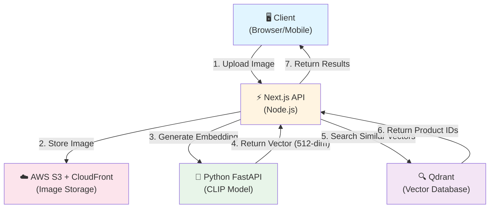
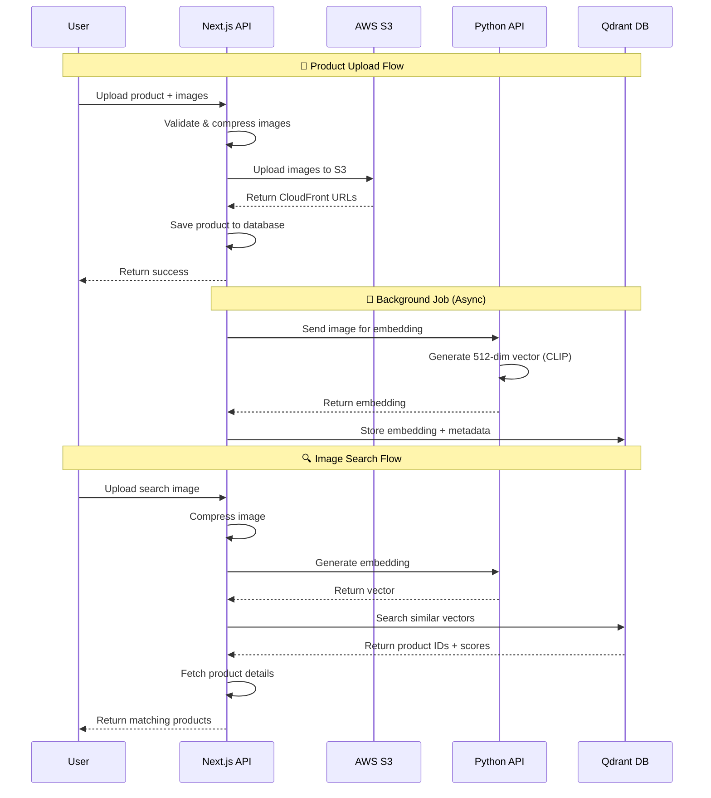

# Building a Production-Ready Image Search System with Next.js, CLIP, and Qdrant

## Introduction

Visual search has become an essential feature in modern e-commerce and content platforms. Instead of describing products with keywords, users can simply upload an image and find visually similar items. In this comprehensive guide, I'll walk you through building a production-ready image search system using Next.js, the CLIP machine learning model, and Qdrant vector database.

**What you'll learn:**
- How to integrate CLIP (Contrastive Language-Image Pre-training) for image embeddings
- Setting up Qdrant vector database for similarity search
- Building a scalable architecture with Next.js API routes
- Optimizing performance for production use
- Handling images with AWS S3 and CloudFront

## Table of Contents

1. [Architecture Overview](#architecture-overview)
2. [Technology Stack](#technology-stack)
3. [Prerequisites](#prerequisites)
4. [Step 1: Setting Up the Vector Database](#step-1-setting-up-the-vector-database)
5. [Step 2: Creating the Python Embedding Service](#step-2-creating-the-python-embedding-service)
6. [Step 3: Integrating with Next.js](#step-3-integrating-with-nextjs)
7. [Step 4: Implementing Image Upload and Storage](#step-4-implementing-image-upload-and-storage)
8. [Step 5: Generating and Storing Embeddings](#step-5-generating-and-storing-embeddings)
9. [Step 6: Building the Search API](#step-6-building-the-search-api)
10. [Performance Optimization](#performance-optimization)
11. [Production Considerations](#production-considerations)
12. [Conclusion](#conclusion)

---

## Architecture Overview

Our image search system follows a microservices architecture with the following data flow:



### Key Components

| Component | Technology | Role |
|-----------|-----------|------|
| **Client** | Browser/Mobile | User interface for uploading images and viewing results |
| **Next.js API** | Node.js + TypeScript | Orchestration layer, handles HTTP requests and authentication |
| **Python FastAPI** | Python 3.11 + FastAPI | ML inference service for generating CLIP embeddings |
| **AWS S3 + CloudFront** | Cloud Storage + CDN | Stores and serves images with low latency |
| **Qdrant** | Vector Database | Stores embeddings and performs similarity search |

### Data Flow



### Why This Architecture?

| Benefit | Description |
|---------|-------------|
| **🔧 Separation of Concerns** | Python handles ML workload, Node.js handles business logic |
| **📈 Scalability** | Each service can scale independently based on load |
| **⚡ Performance** | CloudFront CDN for fast image delivery, Qdrant for fast vector search |
| **🛠️ Maintainability** | Clean separation makes debugging and updates easier |
| **💰 Cost-Effective** | Use free tiers: Qdrant (1GB), Railway ($5/month credit) |
| **🔒 Security** | Centralized authentication in Next.js, isolated ML service |

---

## Technology Stack

### Core Technologies

- **Next.js 14+**: Modern React framework with API routes
- **TypeScript**: Type safety and better developer experience
- **Python 3.11+**: For machine learning inference
- **FastAPI**: High-performance Python web framework

### Machine Learning

- **CLIP (openai/clip-vit-base-patch32)**: Multi-modal model for image embeddings
- **Transformers**: Hugging Face library for CLIP model
- **PyTorch**: Deep learning framework

### Storage & Database

- **Qdrant Cloud**: Vector database (free tier: 1GB storage)
- **AWS S3**: Object storage for images
- **AWS CloudFront**: CDN for fast image delivery
- **PostgreSQL**: Relational database (via Prisma)

### Deployment

- **Railway**: For Python FastAPI service (free tier available)
- **Vercel/Railway**: For Next.js application

---

## Prerequisites

Before starting, ensure you have:

1. **Node.js 18+** and **Python 3.11+** installed
2. **AWS Account** with S3 bucket created
3. **Qdrant Cloud Account** (free tier)
4. **Railway Account** (for Python service deployment)
5. Basic understanding of Next.js, Python, and REST APIs

---

## Step 1: Setting Up the Vector Database

### 1.1 Create Qdrant Cloud Account

1. Visit [Qdrant Cloud](https://cloud.qdrant.io/)
2. Sign up for a free account (1GB storage, ~400k vectors)
3. Create a new cluster
4. Note down your **API URL** and **API Key**

### 1.2 Create Vector Collection

Qdrant will auto-create collections, but understanding the structure is important:

```javascript
// Collection configuration
{
  name: "product-images",
  vectors: {
    size: 512,           // CLIP embedding dimension
    distance: "Cosine"   // Similarity metric
  }
}
```

### 1.3 Install Qdrant Client

```bash
npm install @qdrant/js-client-rest
```

### 1.4 Create Vector Store Service

Create `packages/database/src/ml/vector-store.ts`:

```typescript
import { QdrantClient } from '@qdrant/js-client-rest';

export class ProductVectorStore {
  private client: QdrantClient;
  private collectionName = 'product-images';

  constructor() {
    this.client = new QdrantClient({
      url: process.env.QDRANT_URL!,
      apiKey: process.env.QDRANT_API_KEY
    });
  }

  /**
   * Search for similar products by image embedding
   */
  async search(
    queryEmbedding: number[],
    filters: {
      merchantId?: string;
      categoryId?: string;
      limit?: number;
      minSimilarity?: number;
    }
  ) {
    const { merchantId, categoryId, limit = 20, minSimilarity = 0.7 } = filters;

    // Build Qdrant filter
    const must: any[] = [];
    if (merchantId) {
      must.push({ key: 'merchantId', match: { value: merchantId } });
    }
    if (categoryId) {
      must.push({ key: 'categoryId', match: { value: categoryId } });
    }

    // Perform vector search
    const searchResults = await this.client.search(this.collectionName, {
      vector: queryEmbedding,
      limit: limit * 3, // Get more results for filtering
      filter: must.length > 0 ? { must } : undefined,
      with_payload: true
    });

    // Filter by similarity score and group by product
    const productMap = new Map<string, any>();
    
    for (const result of searchResults) {
      if (result.score < minSimilarity) continue;
      
      const productId = result.payload?.productId as string;
      if (!productMap.has(productId)) {
        productMap.set(productId, {
          productId,
          similarity: result.score,
          imageUrl: result.payload?.imageUrl
        });
      }
    }

    return Array.from(productMap.values()).slice(0, limit);
  }

  /**
   * Store product image embeddings
   */
  async storeProductImagesEmbeddings(
    embeddings: Array<{
      imageId: string;
      embedding: number[];
      metadata: {
        productId: string;
        imageUrl: string;
        merchantId: string;
        categoryId?: string;
        productName: string;
      };
    }>
  ) {
    const points = embeddings.map(({ imageId, embedding, metadata }) => ({
      id: imageId,
      vector: embedding,
      payload: {
        ...metadata,
        updatedAt: new Date().toISOString()
      }
    }));

    await this.client.upsert(this.collectionName, {
      wait: true,
      points
    });
  }
}

// Singleton pattern
let vectorStore: ProductVectorStore | null = null;

export function getVectorStore(): ProductVectorStore {
  if (!vectorStore) {
    vectorStore = new ProductVectorStore();
  }
  return vectorStore;
}
```

**Key points:**

- **Singleton pattern**: Reuse client connection across requests
- **Cosine similarity**: Measures angle between vectors (ideal for normalized embeddings)
- **Filtering**: Narrow search by merchant, category, etc.
- **Score threshold**: Filter out low-similarity results

---

## Step 2: Creating the Python Embedding Service

### 2.1 Project Structure

```
python-embedding-service/
├── app/
│   ├── __init__.py
│   ├── main.py       # FastAPI application
│   ├── models.py     # CLIP model wrapper
│   └── utils.py      # Image processing utilities
├── requirements.txt
├── Dockerfile
└── railway.json
```

### 2.2 Install Dependencies

Create `requirements.txt`:

```txt
fastapi==0.104.1
uvicorn[standard]==0.24.0
python-multipart==0.0.6
pillow==10.1.0
torch==2.1.0
transformers==4.35.0
numpy==1.24.3
```

### 2.3 Create CLIP Model Wrapper

Create `app/models.py`:

```python
"""CLIP model wrapper for image embedding generation"""

import torch
from transformers import CLIPProcessor, CLIPModel
from PIL import Image
import io
import numpy as np
from typing import List

class EmbeddingModel:
    """CLIP model wrapper for image embedding generation"""
    
    def __init__(self, model_name: str = "openai/clip-vit-base-patch32"):
        self.model_name = model_name
        self.model = None
        self.processor = None
        self.device = "cuda" if torch.cuda.is_available() else "cpu"
        self._loaded = False
    
    async def load(self):
        """Load CLIP model and processor"""
        print(f"🔄 Loading model: {self.model_name} on {self.device}...")
        
        self.processor = CLIPProcessor.from_pretrained(self.model_name)
        self.model = CLIPModel.from_pretrained(self.model_name)
        self.model.to(self.device)
        self.model.eval()  # Set to evaluation mode
        
        self._loaded = True
        print(f"✅ Model loaded successfully")
    
    async def generate_embedding(self, image_bytes: bytes) -> List[float]:
        """Generate embedding from image bytes"""
        if not self._loaded:
            raise RuntimeError("Model not loaded. Call load() first.")
        
        # Load and convert image
        image = Image.open(io.BytesIO(image_bytes))
        if image.mode != 'RGB':
            image = image.convert('RGB')
        
        # Process image
        inputs = self.processor(images=image, return_tensors="pt")
        inputs = {k: v.to(self.device) for k, v in inputs.items()}
        
        # Generate embedding
        with torch.no_grad():
            outputs = self.model.get_image_features(**inputs)
            embedding = outputs[0].cpu().numpy()
        
        # Normalize for cosine similarity
        norm = np.linalg.norm(embedding)
        if norm > 0:
            embedding = embedding / norm
        
        return embedding.tolist()
```

**Why CLIP?**

- **Multi-modal**: Understands both images and text
- **Pre-trained**: No training required, works out of the box
- **512 dimensions**: Good balance between accuracy and storage
- **Normalized vectors**: Perfect for cosine similarity search

### 2.4 Create FastAPI Application

Create `app/main.py`:

```python
"""FastAPI service for image embedding generation"""

from fastapi import FastAPI, File, UploadFile, HTTPException
from fastapi.middleware.cors import CORSMiddleware
from fastapi.responses import JSONResponse
import uvicorn
import os
from app.models import EmbeddingModel

app = FastAPI(
    title="Image Embedding API",
    description="Generate CLIP embeddings for image search",
    version="1.0.0"
)

# CORS middleware
app.add_middleware(
    CORSMiddleware,
    allow_origins=["*"],  # Restrict in production
    allow_credentials=True,
    allow_methods=["*"],
    allow_headers=["*"],
)

# Global model instance
model: EmbeddingModel = None

@app.on_event("startup")
async def startup_event():
    """Load model on startup"""
    global model
    print("🔄 Loading CLIP model...")
    model = EmbeddingModel()
    await model.load()
    print("✅ Model loaded successfully")

@app.get("/health")
async def health_check():
    """Health check endpoint"""
    return {
        "status": "healthy",
        "model_loaded": model is not None
    }

@app.post("/embed")
async def generate_embedding(file: UploadFile = File(...)):
    """Generate embedding from uploaded image"""
    try:
        # Validate file type
        if not file.content_type.startswith('image/'):
            raise HTTPException(400, "Invalid file type")
        
        # Read image bytes
        image_bytes = await file.read()
        
        if len(image_bytes) == 0:
            raise HTTPException(400, "Empty file")
        
        # Generate embedding
        embedding = await model.generate_embedding(image_bytes)
        
        return JSONResponse({
            "success": True,
            "embedding": embedding,
            "dimension": len(embedding),
            "normalized": True
        })
    
    except HTTPException:
        raise
    except Exception as e:
        raise HTTPException(500, f"Embedding generation failed: {str(e)}")

if __name__ == "__main__":
    uvicorn.run(
        "app.main:app",
        host="0.0.0.0",
        port=int(os.getenv("PORT", "8000")),
        reload=False
    )
```

### 2.5 Create Dockerfile

```dockerfile
FROM python:3.11-slim

WORKDIR /app

# Install system dependencies
RUN apt-get update && apt-get install -y \
    build-essential \
    && rm -rf /var/lib/apt/lists/*

# Install Python dependencies
COPY requirements.txt .
RUN pip install --no-cache-dir -r requirements.txt

# Copy application code
COPY app/ ./app/

# Expose port
EXPOSE 8000

# Run application
CMD ["uvicorn", "app.main:app", "--host", "0.0.0.0", "--port", "8000"]
```

### 2.6 Deploy to Railway

1. **Push to GitHub**:
   ```bash
   git add python-embedding-service/
   git commit -m "Add Python embedding service"
   git push
   ```

2. **Create Railway Service**:
   - Go to [Railway Dashboard](https://railway.app/)
   - Click "New Project" → "Deploy from GitHub"
   - Select your repository
   - Set root directory to `python-embedding-service`
   - Railway will auto-detect the Dockerfile

3. **Get Service URL**:
   - After deployment, Railway provides a URL
   - Example: `https://python-embedding-service-production.up.railway.app`

4. **Test the service**:
   ```bash
   curl https://your-railway-url.up.railway.app/health
   # Should return: {"status": "healthy", "model_loaded": true}
   ```

**Cost**: Railway free tier provides $5/month credit, which is enough for ~100 hours of runtime.

---

## Step 3: Integrating with Next.js

### 3.1 Create Embedding Service Client

Create `packages/database/src/ml/embedding-service.ts`:

```typescript
/**
 * Client for Python embedding service
 */
export class EmbeddingService {
  private apiUrl: string;

  constructor() {
    this.apiUrl = process.env.PYTHON_EMBEDDING_API_URL || 'http://localhost:8000';
  }

  /**
   * Generate embedding from image buffer
   */
  async generateEmbeddingFromBuffer(buffer: Buffer): Promise<number[]> {
    try {
      // Create FormData
      const formData = new FormData();
      formData.append('file', new Blob([buffer]), 'image.jpg');

      // Call Python API
      const response = await fetch(`${this.apiUrl}/embed`, {
        method: 'POST',
        body: formData,
      });

      if (!response.ok) {
        throw new Error(`Embedding API error: ${response.statusText}`);
      }

      const data = await response.json();
      
      if (!data.success || !data.embedding) {
        throw new Error('Invalid response from embedding API');
      }

      return data.embedding;
    } catch (error) {
      console.error('Error generating embedding:', error);
      throw error;
    }
  }

  /**
   * Generate embedding from image URL
   */
  async generateEmbedding(imageUrl: string): Promise<number[]> {
    try {
      // Download image
      const imageResponse = await fetch(imageUrl);
      if (!imageResponse.ok) {
        throw new Error(`Failed to download image: ${imageResponse.statusText}`);
      }

      const arrayBuffer = await imageResponse.arrayBuffer();
      const buffer = Buffer.from(arrayBuffer);

      // Generate embedding
      return await this.generateEmbeddingFromBuffer(buffer);
    } catch (error) {
      console.error('Error generating embedding from URL:', error);
      throw error;
    }
  }

  /**
   * Health check
   */
  async healthCheck(): Promise<boolean> {
    try {
      const response = await fetch(`${this.apiUrl}/health`);
      const data = await response.json();
      return data.status === 'healthy' && data.model_loaded === true;
    } catch {
      return false;
    }
  }
}

// Singleton
let embeddingService: EmbeddingService | null = null;

export function getEmbeddingService(): EmbeddingService {
  if (!embeddingService) {
    embeddingService = new EmbeddingService();
  }
  return embeddingService;
}
```

### 3.2 Configure Environment Variables

Add to your `.env`:

```bash
# Python Embedding Service
PYTHON_EMBEDDING_API_URL=https://your-railway-url.up.railway.app

# Qdrant Vector Database
QDRANT_URL=https://your-cluster.qdrant.io
QDRANT_API_KEY=your-api-key

# AWS S3 (for images)
AWS_REGION=us-east-1
AWS_ACCESS_KEY_ID=your-access-key
AWS_SECRET_ACCESS_KEY=your-secret-key
AWS_S3_BUCKET_NAME=your-bucket-name
CLOUDFRONT_DOMAIN=your-cloudfront-domain.cloudfront.net
```

---

## Step 4: Implementing Image Upload and Storage

### 4.1 Image Compression Utility

Create `packages/utils/src/image/compression.ts`:

```typescript
import sharp from 'sharp';

/**
 * Compress image to under 1MB while maintaining quality
 */
export async function compressImageTo1MB(
  buffer: Buffer,
  maxSizeBytes: number = 1024 * 1024 // 1MB
): Promise<Buffer> {
  const metadata = await sharp(buffer).metadata();
  
  // Skip if already small enough
  if (buffer.length <= maxSizeBytes * 0.8) {
    return buffer;
  }

  // Calculate resize dimensions
  const { width, height } = metadata;
  let targetWidth = width || 1920;
  let targetHeight = height || 1080;
  
  if (targetWidth > 1920 || targetHeight > 1080) {
    const aspectRatio = targetWidth / targetHeight;
    if (aspectRatio > 1) {
      targetWidth = 1920;
      targetHeight = Math.round(1920 / aspectRatio);
    } else {
      targetHeight = 1080;
      targetWidth = Math.round(1080 * aspectRatio);
    }
  }

  // Compress with quality adjustment
  let quality = 85;
  let compressed: Buffer;

  for (let attempt = 0; attempt < 3; attempt++) {
    compressed = await sharp(buffer)
      .resize(targetWidth, targetHeight, { fit: 'inside' })
      .jpeg({ quality, mozjpeg: true })
      .toBuffer();

    if (compressed.length <= maxSizeBytes) {
      return compressed;
    }

    // Reduce quality for next attempt
    quality -= 15;
  }

  return compressed!;
}
```

### 4.2 S3 Upload Utility

Create `packages/utils/src/storage/s3.ts`:

```typescript
import { S3Client, PutObjectCommand, CopyObjectCommand } from '@aws-sdk/client-s3';

const s3Client = new S3Client({
  region: process.env.AWS_REGION!,
  credentials: {
    accessKeyId: process.env.AWS_ACCESS_KEY_ID!,
    secretAccessKey: process.env.AWS_SECRET_ACCESS_KEY!
  }
});

/**
 * Upload image to S3 staging
 */
export async function uploadToS3(
  buffer: Buffer,
  options: {
    folder: string;
    fileName: string;
    contentType: string;
  }
): Promise<string> {
  const key = `${options.folder}/${options.fileName}`;
  
  await s3Client.send(new PutObjectCommand({
    Bucket: process.env.AWS_S3_BUCKET_NAME!,
    Key: key,
    Body: buffer,
    ContentType: options.contentType
  }));

  // Return CloudFront URL if available
  if (process.env.CLOUDFRONT_DOMAIN) {
    return `https://${process.env.CLOUDFRONT_DOMAIN}/${key}`;
  }

  // Fallback to S3 URL
  return `https://${process.env.AWS_S3_BUCKET_NAME}.s3.${process.env.AWS_REGION}.amazonaws.com/${key}`;
}

/**
 * Commit files from staging to production folder
 */
export async function commitStagingFiles(
  stagingKeys: string[],
  targetFolder: string
): Promise<{ committedKeys: string[] }> {
  const committedKeys: string[] = [];

  for (const stagingKey of stagingKeys) {
    const fileName = stagingKey.split('/').pop()!;
    const productionKey = `${targetFolder}/${fileName}`;

    await s3Client.send(new CopyObjectCommand({
      Bucket: process.env.AWS_S3_BUCKET_NAME!,
      CopySource: `${process.env.AWS_S3_BUCKET_NAME}/${stagingKey}`,
      Key: productionKey
    }));

    committedKeys.push(productionKey);
  }

  return { committedKeys };
}
```

**Two-phase upload pattern:**

1. **Staging**: Upload to temporary folder first
2. **Production**: Commit to permanent folder after validation

This pattern allows rollback if product creation fails.

---

## Step 5: Generating and Storing Embeddings

### 5.1 Background Job for Embedding Generation

Create `packages/database/src/jobs/generate-product-embeddings.ts`:

```typescript
import { randomUUID } from 'crypto';
import { db } from '../client';
import { getEmbeddingService } from '../ml/embedding-service';
import { getVectorStore } from '../ml/vector-store';

/**
 * Generate and store embeddings for product images
 * This runs as a background job after product creation
 */
export async function generateProductEmbedding(productId: string): Promise<void> {
  try {
    console.log(`🔄 Generating embeddings for product: ${productId}`);

    // 1. Fetch product from database
    const product = await db.products.findById(productId);
    if (!product) {
      throw new Error('Product not found');
    }

    // 2. Parse image URLs
    const images = product.images ? product.images.split(',') : [];
    if (images.length === 0) {
      console.log(`⚠️ No images for product: ${productId}`);
      return;
    }

    console.log(`📸 Processing ${images.length} images...`);

    // 3. Generate embeddings for all images
    const embeddingService = getEmbeddingService();
    const embeddings = await Promise.all(
      images.map(async (imageUrl, index) => {
        try {
          console.log(`  🔄 Processing image ${index + 1}/${images.length}...`);
          
          // Generate embedding
          const embedding = await embeddingService.generateEmbedding(imageUrl);
          
          console.log(`  ✅ Generated embedding (${embedding.length} dimensions)`);

          return {
            imageId: randomUUID(),
            embedding,
            metadata: {
              productId: String(product.publicId),
              imageUrl,
              merchantId: String(product.merchantId),
              categoryId: product.categoryId ? String(product.categoryId) : undefined,
              productName: product.name
            }
          };
        } catch (error) {
          console.error(`  ❌ Error processing image ${index + 1}:`, error);
          return null;
        }
      })
    );

    // Filter out failed embeddings
    const validEmbeddings = embeddings.filter(Boolean) as any[];

    if (validEmbeddings.length === 0) {
      throw new Error('No valid embeddings generated');
    }

    // 4. Store embeddings in Qdrant
    console.log(`💾 Storing ${validEmbeddings.length} embeddings in Qdrant...`);
    const vectorStore = getVectorStore();
    await vectorStore.storeProductImagesEmbeddings(validEmbeddings);

    console.log(`✅ Successfully generated embeddings for product: ${productId}`);
  } catch (error) {
    console.error(`❌ Error generating embeddings for product ${productId}:`, error);
    throw error;
  }
}
```

### 5.2 Trigger Background Job After Product Creation

In your product creation API (`apps/api/app/api/products/route.ts`):

```typescript
export const POST = async (request: NextRequest) => {
  try {
    // ... product creation logic ...

    // Create product
    const product = await db.products.create({
      name: data.name,
      images: imageUrls.join(','),
      // ... other fields
    });

    // ✨ Trigger background embedding generation (non-blocking)
    if (imageUrls.length > 0) {
      generateProductEmbedding(product.id).catch((error) => {
        console.error(`Background job error for product ${product.id}:`, error);
        // Don't fail the request if embedding generation fails
      });
    }

    return NextResponse.json({
      success: true,
      data: product
    });
  } catch (error) {
    // ... error handling
  }
};
```

**Why background job?**

- **Non-blocking**: API responds immediately
- **Better UX**: Users don't wait for embedding generation
- **Resilient**: Product creation succeeds even if embedding fails
- **Asynchronous**: Embedding can take 1-3 seconds per image

---

## Step 6: Building the Search API

### 6.1 Create Search by Image Endpoint

Create `apps/api/app/api/products/searchByImage/route.ts`:

```typescript
import { NextRequest, NextResponse } from 'next/server';
import { withAuthRoles } from '@rentalshop/auth';
import { compressImageTo1MB } from '@rentalshop/utils';
import { getEmbeddingService, getVectorStore } from '@rentalshop/database/server';
import { db } from '@rentalshop/database';

/**
 * POST /api/products/searchByImage
 * Search products by uploading an image
 */
export const POST = withAuthRoles(['ADMIN', 'MERCHANT', 'OUTLET_ADMIN', 'OUTLET_STAFF'])(
  async (request, { user, userScope }) => {
    try {
      // ============================================
      // STEP 1: Parse Request
      // ============================================
      const formData = await request.formData();
      const imageFile = formData.get('image') as File;
      const categoryId = formData.get('categoryId') as string | null;
      const limit = parseInt(formData.get('limit') as string) || 20;
      const minSimilarity = parseFloat(formData.get('minSimilarity') as string) || 0.7;

      if (!imageFile) {
        return NextResponse.json(
          { error: 'No image file provided' },
          { status: 400 }
        );
      }

      console.log(`🔍 Image search request:`, {
        fileName: imageFile.name,
        fileSize: imageFile.size,
        categoryId,
        limit,
        minSimilarity
      });

      // ============================================
      // STEP 2: Compress Image
      // ============================================
      const bytes = await imageFile.arrayBuffer();
      const buffer = await compressImageTo1MB(Buffer.from(new Uint8Array(bytes)));
      
      console.log(`✅ Image compressed: ${buffer.length} bytes`);

      // ============================================
      // STEP 3: Generate Embedding
      // ============================================
      const embeddingService = getEmbeddingService();
      const queryEmbedding = await embeddingService.generateEmbeddingFromBuffer(buffer);
      
      console.log(`✅ Embedding generated: ${queryEmbedding.length} dimensions`);

      // ============================================
      // STEP 4: Search in Qdrant
      // ============================================
      const vectorStore = getVectorStore();
      const searchResults = await vectorStore.search(queryEmbedding, {
        merchantId: userScope.merchantId ? String(userScope.merchantId) : undefined,
        categoryId: categoryId || undefined,
        limit,
        minSimilarity
      });

      console.log(`✅ Found ${searchResults.length} matching images`);

      // ============================================
      // STEP 5: Fetch Product Details
      // ============================================
      const productIds = searchResults.map(r => parseInt(r.productId));
      const products = await Promise.all(
        productIds.map(id => db.products.findById(id))
      );

      // Combine with similarity scores
      const productsWithSimilarity = products
        .filter(Boolean)
        .map((product, index) => ({
          ...product,
          similarity: searchResults[index].similarity,
          matchedImage: searchResults[index].imageUrl
        }));

      console.log(`✅ Returning ${productsWithSimilarity.length} products`);

      // ============================================
      // STEP 6: Return Results
      // ============================================
      return NextResponse.json({
        success: true,
        data: {
          products: productsWithSimilarity,
          total: productsWithSimilarity.length
        }
      });

    } catch (error: any) {
      console.error('❌ Image search error:', error);
      return NextResponse.json(
        { error: error.message || 'Image search failed' },
        { status: 500 }
      );
    }
  }
);
```

### 6.2 Client-side Usage

Create a React component for image search:

```typescript
'use client';

import { useState } from 'react';
import { Button, Card } from '@rentalshop/ui';

export function ImageSearchDialog() {
  const [selectedImage, setSelectedImage] = useState<File | null>(null);
  const [results, setResults] = useState<any[]>([]);
  const [loading, setLoading] = useState(false);

  const handleSearch = async () => {
    if (!selectedImage) return;

    setLoading(true);
    try {
      const formData = new FormData();
      formData.append('image', selectedImage);
      formData.append('limit', '20');
      formData.append('minSimilarity', '0.7');

      const response = await fetch('/api/products/searchByImage', {
        method: 'POST',
        body: formData,
        headers: {
          'Authorization': `Bearer ${getToken()}`
        }
      });

      const data = await response.json();
      
      if (data.success) {
        setResults(data.data.products);
      }
    } catch (error) {
      console.error('Search failed:', error);
    } finally {
      setLoading(false);
    }
  };

  return (
    <div className="space-y-4">
      <input
        type="file"
        accept="image/*"
        onChange={(e) => setSelectedImage(e.target.files?.[0] || null)}
      />
      
      <Button onClick={handleSearch} disabled={!selectedImage || loading}>
        {loading ? 'Searching...' : 'Search Similar Products'}
      </Button>

      <div className="grid grid-cols-4 gap-4">
        {results.map((product) => (
          <Card key={product.id}>
            
            <h3>{product.name}</h3>
            <p>Similarity: {(product.similarity * 100).toFixed(1)}%</p>
          </Card>
        ))}
      </div>
    </div>
  );
}
```

---

## Performance Optimization

### 1. Skip Compression for Small Images

```typescript
export async function compressImageTo1MB(buffer: Buffer): Promise<Buffer> {
  // Skip if already small enough (saves 50-100ms)
  if (buffer.length <= 1024 * 1024 * 0.8) {
    return buffer;
  }
  // ... compression logic
}
```

### 2. Connection Pooling for Python API

```typescript
import { Agent } from 'https';

const httpsAgent = new Agent({
  keepAlive: true,
  maxSockets: 10
});

// Use in fetch calls
await fetch(url, { agent: httpsAgent });
```

### 3. Reduce Vector Search Limit

```typescript
// Instead of limit * 3, use limit * 2
const searchLimit = Math.max(limit * 2, 30);
```

### 4. Use Score Threshold in Qdrant

```typescript
const searchResults = await this.client.search(this.collectionName, {
  vector: queryEmbedding,
  score_threshold: minSimilarity, // Filter at Qdrant level
  limit: limit,
  filter: filters
});
```

### 5. Batch Product Fetching

```typescript
// Instead of sequential fetches
const products = await db.products.findMany({
  where: { id: { in: productIds } }
});
```

**Performance results:**

| Optimization | Time Saved | Impact |
|--------------|------------|--------|
| Skip compression | 50-100ms | Medium |
| Connection pooling | 100-200ms | High |
| Reduce search limit | 50-150ms | Medium |
| Score threshold | 50-100ms | Medium |
| Batch fetching | 30-50ms | Low |
| **Total** | **280-600ms** | **High** |

**Before optimizations**: ~3-5 seconds  
**After optimizations**: ~2-2.5 seconds

---

## Production Considerations

### 1. Monitoring and Logging

```typescript
// Log all search requests
console.log('Image search:', {
  userId: user.id,
  duration: Date.now() - startTime,
  resultsCount: results.length,
  cacheHit: false
});
```

### 2. Rate Limiting

```typescript
// Limit to 10 searches per minute per user
import { Ratelimit } from '@upstash/ratelimit';

const ratelimit = new Ratelimit({
  redis: Redis.fromEnv(),
  limiter: Ratelimit.slidingWindow(10, '1 m'),
});

const { success } = await ratelimit.limit(user.id);
if (!success) {
  return NextResponse.json({ error: 'Rate limit exceeded' }, { status: 429 });
}
```

### 3. Error Handling

```typescript
try {
  // ... search logic
} catch (error) {
  // Log to error tracking service
  console.error('Image search error:', {
    userId: user.id,
    error: error.message,
    stack: error.stack
  });

  // Return user-friendly message
  return NextResponse.json({
    error: 'Search temporarily unavailable'
  }, { status: 503 });
}
```

### 4. Caching

```typescript
// Cache embedding for same image hash
import { createHash } from 'crypto';

const imageHash = createHash('md5').update(buffer).digest('hex');
const cached = await redis.get(`embedding:${imageHash}`);

if (cached) {
  return JSON.parse(cached);
}

const embedding = await generateEmbedding(buffer);
await redis.set(`embedding:${imageHash}`, JSON.stringify(embedding), 'EX', 86400);
```

### 5. Scaling Considerations

**Qdrant Cloud Free Tier Limits:**
- 1GB storage = ~400,000 vectors
- For 2 images per product = ~200,000 products

**Python Service Scaling:**
- Railway free tier: $5/month credit
- For high traffic, consider:
  - Upgrading Railway plan
  - Self-hosting on AWS EC2/ECS
  - Using managed ML inference services

**Next.js API Scaling:**
- Vercel automatically scales
- For self-hosting, use load balancers

---

## Conclusion

You've now built a production-ready image search system with:

✅ **CLIP model** for generating image embeddings  
✅ **Qdrant vector database** for fast similarity search  
✅ **Python FastAPI service** for ML inference  
✅ **Next.js API** for orchestration  
✅ **AWS S3 + CloudFront** for image storage and delivery  
✅ **Background jobs** for non-blocking embedding generation  
✅ **Performance optimizations** for sub-3-second search  

**Key takeaways:**

1. **Separation of concerns**: Use Python for ML, Node.js for business logic
2. **Asynchronous processing**: Generate embeddings in background jobs
3. **Vector databases**: Qdrant provides fast and scalable similarity search
4. **Performance matters**: Optimize each step to reduce latency
5. **Production-ready**: Include monitoring, error handling, and rate limiting

**Next steps:**

- Add **text search** capability using CLIP's text encoding
- Implement **hybrid search** (combine image + text + filters)
- Add **search analytics** to understand user behavior
- Experiment with **different CLIP models** for better accuracy
- Consider **fine-tuning** CLIP for your specific domain

**Resources:**

- [Qdrant Documentation](https://qdrant.tech/documentation/)
- [CLIP Paper](https://arxiv.org/abs/2103.00020)
- [FastAPI Documentation](https://fastapi.tiangolo.com/)
- [Railway Documentation](https://docs.railway.app/)

---

**About the Author**

I'm a full-stack developer building modern web applications with Next.js, TypeScript, and machine learning. Follow me for more technical deep-dives!

---

*Published on Medium • January 2026*
